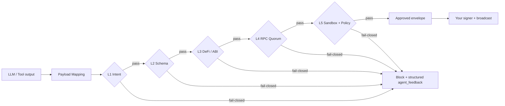
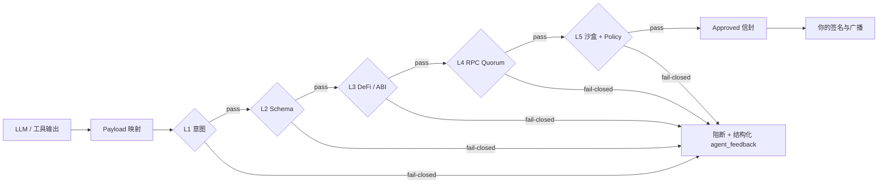

<div align="center">
  <a href="https://pypi.org/project/lirix/"></a>
  
  
  
</div>

<p align="center">
  <b>English</b> | <a href="#-简体中文-chinese-version">🇨🇳 简体中文</a> | <a href="docs/migration_legacy_to_v2.md">Migration</a> | <a href="#-installation--setup">📦 Installation</a> | <a href="#-quickstart-five-minute-blitz">⚡ Quickstart</a> | <a href="#-ecosystem-integrations-langchain--autogen">🌐 Integrations</a> | <a href="#-architecture--security-trace">🏗️ Architecture</a> | <a href="#-support--faq">💬 Support</a>
</p>

# Lirix 2.0 · The EVM-grade execution airlock for AI agents

[](https://pypi.org/project/lirix/)
[](https://github.com/lokii-D/lirix/actions)

**Lirix is a fail-closed validation and simulation control plane that stands between untrusted agent payloads and anything that can move value.** It is not a signer; it is the execution airlock that forces intent, schema, ABI, RPC evidence, and local EVM simulation through L1–L5 before any broadcast handoff is emitted.

## 🎯 Why Lirix?

The Web3 agent stack fails in predictable ways: prompt injection becomes malicious calldata, toxic DeFi shapes pass review but fail on-chain, proxies hide real code paths, and RPC views diverge under load. Lirix collapses that attack surface into a single deterministic DAG: validate intent, decode and pierce contracts, reconcile RPC evidence, simulate with state overrides, and only then return an evidence-rich envelope that your orchestrator can retry, rewrite, or reject without guessing.

## 📦 Installation & Setup

```bash
python3 -m venv .venv
source .venv/bin/activate  # Windows: `.venv\\Scripts\\activate`
pip install lirix
lirix init
```

## ⚡ Quickstart: Five-Minute Blitz

### 1) Fail-closed validation and simulation

```python
from typing import Any, Mapping

from lirix import Lirix

guardian = Lirix(rpc_urls=["https://eth-mainnet.g.alchemy.com/v2/…"])
draft: Mapping[str, Any] = {
    "to": "0x0000000000000000000000000000000000000001",
    "data": "0x",
    "value": 0,
}
result = guardian.validate_and_simulate("swap", draft)
print(result["decision"], result["status"], result["agent_feedback"]["reason_code"])
print(result["payload"].get("simulation_ok"))
```

### 2) Extract the broadcast handoff

Use **`Lirix.extract_broadcast_fields(result)`** only after both `decision` and `status` are `"approved"`. The signer should receive the extracted broadcast fields, not the full result envelope.

```python
from lirix import Lirix

broadcast_fields = Lirix.extract_broadcast_fields(result)
# 签名并广播（broadcast_fields）
```

### 3) Failure triage

When a request is blocked, inspect **`agent_feedback.remediation`**, then **`agent_feedback.reason_code`**, then resolve the protocol with **`resolve_failure_protocol(...)`** or **`Lirix.resolve_failure_protocol(...)`**. Stable audit fields include **`canonical_error_code`**, **`failure_type_canonical`**, **`canonical_reason_codes`**, and the replay-facing aliases inside **`forensic_bundle`**.

### 4) E2E regression mirror

```bash
pytest -q tests/test_integration/test_real_e2e_paths.py
```

## 🌐 Ecosystem Integrations (LangChain & AutoGen)

**Rule:** `validate_and_simulate` takes `intent: str` and `payload: Mapping[str, Any]`. Always schema-lock model output before it crosses the Lirix boundary.

### LangChain

```python
from __future__ import annotations

import json
from typing import Any, Mapping, cast

from langchain_core.tools import tool
from pydantic import BaseModel, ConfigDict, Field

from lirix import Lirix, LirixSecurityException


class LirixValidationRequest(BaseModel):
    model_config = ConfigDict(extra="forbid", str_strip_whitespace=True)

    raw_llm_output: str = Field(..., min_length=1)
    intent: str = Field(..., min_length=1)


class LirixSecurityValidator:
    def __init__(self, guardian: Lirix) -> None:
        self._guardian = guardian

    def validate(self, raw_llm_output: str, intent: str) -> str:
        draft = cast(Mapping[str, Any], json.loads(raw_llm_output))
        # 先做结构化反序列化，再交给 Lirix 执行 fail-closed 校验与模拟
        result = self._guardian.validate_and_simulate(intent, draft)
        # 绝对安全：只提取经过 Lirix 校验并导出的广播字段
        tx_payload = Lirix.extract_broadcast_fields(result)
        return json.dumps({"result": result, "tx_payload": tx_payload}, sort_keys=True, default=str)


guardian = Lirix(rpc_urls=["https://eth-mainnet.g.alchemy.com/v2/…"])
validator = LirixSecurityValidator(guardian=guardian)


@tool("lirix_validate_and_simulate")
def lirix_validate_and_simulate(raw_llm_output: str, intent: str) -> str:
    """在任何广播路径前进行 fail-closed 校验。"""
    return validator.validate(raw_llm_output=raw_llm_output, intent=intent)
```

### AutoGen

```python
from __future__ import annotations

import json
from dataclasses import dataclass
from typing import Any, Mapping, cast

from lirix import Lirix, LirixSecurityException


@dataclass(frozen=True)
class AutoGenLirixBridge:
    guardian: Lirix

    def __call__(self, raw_llm_output: str, intent: str) -> Mapping[str, Any]:
        draft = cast(Mapping[str, Any], json.loads(raw_llm_output))
        try:
            # 先执行意图校验、ABI 解码与沙盒模拟，确认是否满足 fail-closed 门槛
            result = self.guardian.validate_and_simulate(intent, draft)
            return {
                "status": "approved",
                "result": result,
                # 绝对安全：只提取经过 Lirix 校验并导出的广播字段
                "tx_payload": Lirix.extract_broadcast_fields(result),
            }
        except LirixSecurityException as exc:
            # 回退机制：当 Lirix 拦截到攻击时，将重写指令回传给 Agent
            return {"status": "blocked", "resolution_for_agent": exc.resolution_for_agent}


autogen_lirix = AutoGenLirixBridge(guardian=Lirix(rpc_urls=["https://eth-mainnet.g.alchemy.com/v2/…"]))
```

## 🏗️ Architecture & Security Trace

Public **`Lirix`** (`lirix/_facade.py`) composes **`HookManager`**, **`ClientPipelineProtocol`**, and **`LirixPipelineOrchestrator`** into a one-way pipeline with session and trace FSM semantics. Hooks extend policy at the perimeter; they do not bypass the core.



1. **L1** — Intent firewall with injection-resistant allowlists.
2. **L2** — Schema boundary with strict payload typing.
3. **L3** — DeFi / ABI decoding plus proxy piercing.
4. **L4** — Multi-node RPC reconciliation with evidence.
5. **L5** — Local EVM simulation plus shadow policy audit.

`HookManager` gives you RBAC, sandbox routing, OTel export, and pre/post-flight policy hooks without forking the kernel. The rule is simple: the kernel stays deterministic; the perimeter stays customizable.

### Developer paths

- **`validate_only` / `async_validate_only`** — L1–L3 + evidence.
- **`simulate_only` / `async_simulate_only`** — L4–L5, with optional prior validation gate.
- **`validate_and_simulate` / `async_validate_and_simulate`** — full DAG.
- **`atomic_multicall`** — multicall packing with L1–L3 alignment.
- **Layer types** — import from **`lirix.layers`**; hooks and exceptions from **`lirix.core`**.

### Progressive migration flags

`LirixConfig` exposes **`hook_contract_mode`**, **`policy_lifecycle_mode`**, and **`rpc_evidence_mode`**. Move `hook_contract_mode` from **`shadow`** to **`enforce`** only after the hook evidence is clean and the v2 rails are verified.

### Project layout

```text
lirix/
├── lirix/        # core defense layers + facade
├── tests/        # verification + adversarial coverage
├── docs/         # audit + architecture SSOT
└── SECURITY.md   # disclosure policy
```

Full tree: **`docs/STRUCTURE.md`**. Control plane table: **`docs/architecture_control_plane.md`**.

## 🛡️ Security Model

**Triple-Zero:** **Zero-Key · Zero-Telemetry · Zero-Trust** — see **`SECURITY.md`**.

## 💬 Support & FAQ

- **General:** [Discussions](https://github.com/lokii-D/lirix/discussions) / [Issues](https://github.com/lokii-D/lirix/issues)
- **Security:** do **not** open public issues; follow **`SECURITY.md`**.

**Q: Why no private key?**  
A: Lirix validates and simulates; **you** sign. Separation of duties is the model.

**Q: `externally-managed-environment`?**  
A: Use a venv; never `pip install --break-system-packages`.

---

<h1 id="-简体中文-chinese-version">🇨🇳 Lirix 2.0 · 面向 AI Agent 的 EVM 级执行气闸</h1>

**一句话定义：** Lirix 是夹在「不可信模型输出」与「私钥 / 广播」之间的 **fail-closed 校验 + 模拟控制平面**。它不是钱包，也不是 Signer；它是 **EVM-grade execution airlock**，要求意图、Payload、RPC 证据与本地 EVM 模拟逐层通过 **L1–L5 单向 DAG**，然后才吐出可交接的广播字段。

## 🎯 为什么需要 Lirix？

Web3 Agent 的常见死法非常一致：**Prompt 注入** 变成恶意 calldata，**有毒 DeFi 形状** 在审查时看似合理、上线后却 Revert 或失血，**Proxy / Router** 把真实执行路径藏起来，RPC 视图还会在高压下分叉。Lirix 把这些风险压成一条确定性 DAG：先校验意图与结构，再做 ABI 解码与 Proxy 穿透，必要时进行多节点 RPC 对账，并配合 **State Overrides** 做沙盒模拟，最后输出带 **`security_trace`** 与 **`replay_bundle`** 的证据信封——由你的编排器决定重试、改写，还是直接硬拒绝。

## 📦 安装与初始化

```bash
python3 -m venv .venv
source .venv/bin/activate  # Windows：`.venv\\Scripts\\activate`
pip install lirix
lirix init
```

## ⚡ 快速上手：五分钟闪电战

### 1) fail-closed 校验与模拟

```python
from typing import Any, Mapping

from lirix import Lirix

guardian = Lirix(rpc_urls=["https://eth-mainnet.g.alchemy.com/v2/…"])
draft: Mapping[str, Any] = {
    "to": "0x0000000000000000000000000000000000000001",
    "data": "0x",
    "value": 0,
}
result = guardian.validate_and_simulate("swap", draft)
print(result["decision"], result["status"], result["agent_feedback"]["reason_code"])
print(result["payload"].get("simulation_ok"))
```

### 2) 提取广播交接字段

只有当 `decision` 与 `status` 都是 `"approved"` 时，才允许调用 **`Lirix.extract_broadcast_fields(result)`**。签名器只接收提取后的广播字段，绝不接收完整 result envelope。

```python
from lirix import Lirix

broadcast_fields = Lirix.extract_broadcast_fields(result)
# 签名并广播（broadcast_fields）
```

### 3) 失败排查

被阻断时，按顺序查看 **`agent_feedback.remediation`**、**`agent_feedback.reason_code`**，再用 **`resolve_failure_protocol(...)`** 或 **`Lirix.resolve_failure_protocol(...)`** 定位。稳定审计字段包括 **`canonical_error_code`**、**`failure_type_canonical`**、**`canonical_reason_codes`**，以及 **`forensic_bundle`** 中面向回放的别名字段。

### 4) E2E 回归镜像

```bash
pytest -q tests/test_integration/test_real_e2e_paths.py
```

## 🌐 生态集成（LangChain 与 AutoGen）

**规则：** `validate_and_simulate` 只接受 `intent: str` 与 `payload: Mapping[str, Any]`。模型输出必须先做 JSON / schema-lock，再跨过 Lirix 边界。

### LangChain

```python
from __future__ import annotations

import json
from typing import Any, Mapping, cast

from langchain_core.tools import tool
from pydantic import BaseModel, ConfigDict, Field

from lirix import Lirix, LirixSecurityException


class LirixValidationRequest(BaseModel):
    model_config = ConfigDict(extra="forbid", str_strip_whitespace=True)

    raw_llm_output: str = Field(..., min_length=1)
    intent: str = Field(..., min_length=1)


class LirixSecurityValidator:
    def __init__(self, guardian: Lirix) -> None:
        self._guardian = guardian

    def validate(self, raw_llm_output: str, intent: str) -> str:
        draft = cast(Mapping[str, Any], json.loads(raw_llm_output))
        # 先做结构化反序列化，再交给 Lirix 执行 fail-closed 校验与模拟
        result = self._guardian.validate_and_simulate(intent, draft)
        # 绝对安全：只提取经过 Lirix 校验并导出的广播字段
        tx_payload = Lirix.extract_broadcast_fields(result)
        return json.dumps({"result": result, "tx_payload": tx_payload}, sort_keys=True, default=str)


guardian = Lirix(rpc_urls=["https://eth-mainnet.g.alchemy.com/v2/…"])
validator = LirixSecurityValidator(guardian=guardian)


@tool("lirix_validate_and_simulate")
def lirix_validate_and_simulate(raw_llm_output: str, intent: str) -> str:
    """在任何广播路径前进行 fail-closed 校验。"""
    return validator.validate(raw_llm_output=raw_llm_output, intent=intent)
```

### AutoGen

```python
from __future__ import annotations

import json
from dataclasses import dataclass
from typing import Any, Mapping, cast

from lirix import Lirix, LirixSecurityException


@dataclass(frozen=True)
class AutoGenLirixBridge:
    guardian: Lirix

    def __call__(self, raw_llm_output: str, intent: str) -> Mapping[str, Any]:
        draft = cast(Mapping[str, Any], json.loads(raw_llm_output))
        try:
            # 先执行意图校验、ABI 解码与沙盒模拟，确认是否满足 fail-closed 门槛
            result = self.guardian.validate_and_simulate(intent, draft)
            return {
                "status": "approved",
                "result": result,
                # 绝对安全：只提取经过 Lirix 校验并导出的广播字段
                "tx_payload": Lirix.extract_broadcast_fields(result),
            }
        except LirixSecurityException as exc:
            # 回退机制：当 Lirix 拦截到攻击时，将重写指令回传给 Agent
            return {"status": "blocked", "resolution_for_agent": exc.resolution_for_agent}


autogen_lirix = AutoGenLirixBridge(guardian=Lirix(rpc_urls=["https://eth-mainnet.g.alchemy.com/v2/…"]))
```

## 🏗️ 架构与安全追踪

对外 **`Lirix`**（`lirix/_facade.py`）把 **`HookManager`**、**`ClientPipelineProtocol`**、**`LirixPipelineOrchestrator`** 组合成一条单向流水线；会话与追踪由 FSM 约束。Hook 是隔离契约面，只能扩展策略，**不能绕过核心层**。



1. **L1** — 意图防火墙，拦截注入型 Payload。
2. **L2** — Schema 边界，严格类型化 Payload。
3. **L3** — DeFi / ABI 解码与 Proxy 穿透。
4. **L4** — 多节点 RPC 对账与证据收集。
5. **L5** — 本地 EVM 模拟与影子策略审计。

`HookManager` 提供 RBAC、沙盒路由、OTel 导出与前后置策略钩子，而不会把核心内核拆散。原则很简单：**内核保持确定性，外围保持可定制。**

### 开发路径

- **`validate_only` / `async_validate_only`** — L1–L3 + evidence。
- **`simulate_only` / `async_simulate_only`** — L4–L5，可按配置在前面挂验证门。
- **`validate_and_simulate` / `async_validate_and_simulate`** — 全 DAG 路径。
- **`atomic_multicall`** — 与 L1–L3 对齐的 multicall 打包。
- **Layer 类型** — 从 **`lirix.layers`** 导入；Hook 与异常从 **`lirix.core`** 导入。

### 渐进式迁移开关

`LirixConfig` 暴露 **`hook_contract_mode`**、**`policy_lifecycle_mode`**、**`rpc_evidence_mode`**。只有当 hook 证据干净、v2 轨道验证通过后，才把 `hook_contract_mode` 从 **`shadow`** 切到 **`enforce`**。

### 项目结构

```text
lirix/
├── lirix/        # 核心防线层 + 门面
├── tests/        # 验证与对抗覆盖
├── docs/         # 审计与架构单一真相源
└── SECURITY.md   # 披露政策
```

完整目录见 **`docs/STRUCTURE.md`**。控制面表见 **`docs/architecture_control_plane.md`**。

## 🛡️ 安全模型

**Triple-Zero：零密钥 · 零遥测 · 零信任** — 详见 **`SECURITY.md`**。

## 💬 支持与 FAQ

- **普通讨论：** [Discussions](https://github.com/lokii-D/lirix/discussions) / [Issues](https://github.com/lokii-D/lirix/issues)
- **安全问题：** 不要开公开 Issue；请遵循 **`SECURITY.md`**。

**Q：为什么没有私钥？**  
A：Lirix 负责校验与模拟，**你** 负责签名。职责分离是设计本身。

**Q：遇到 `externally-managed-environment` 怎么办？**  
A：先建 venv，永远不要直接 `pip install --break-system-packages`。

---

<div align="center">
  <a href="https://pypi.org/project/lirix/"></a>
  
  
  
</div>

© 2026 lokii-D — see [LICENSE](LICENSE).
