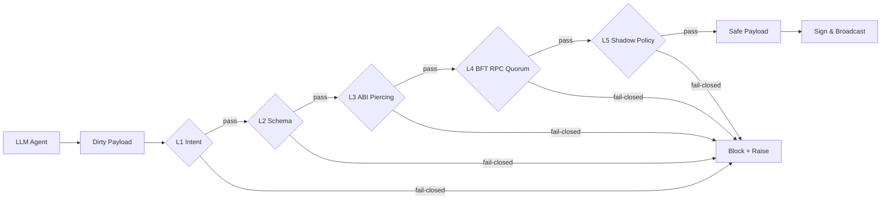

<div align="center">
  <a href="https://pypi.org/project/lirix/"></a>
  
  
  
</div>

<p align="center">
  <b>English</b> | <a href="#-简体中文-chinese-version">🇨🇳 简体中文</a> | <a href="#-installation">📦 Installation</a> | <a href="#-zero-friction-initialization">⚡ Zero-Friction Initialization</a> | <a href="#-ecosystem-integrations-langchain--autogen">🌐 Ecosystem Integrations</a> | <a href="#-deep-dive-the-5-layer-security-shield">🎯 Deep Dive</a> | <a href="#-architecture--hooks">🗺️ Architecture & Hooks</a> | <a href="#-support--faq">💬 Support / FAQ</a>
</p>

# Lirix v1.5.1: The Omniscience Update for Web3 AI Agents

[](https://pypi.org/project/lirix/)
[](https://github.com/lokii-D/lirix/actions)

Lirix v1.5.1 is the responsible operating layer for Web3 AI agents: the deterministic boundary between untrusted model output and on-chain execution. It neutralizes prompt injections, stale RPC reads, hallucinated contract paths, and toxic DeFi payloads before they can ever touch private keys, signing authority, or capital.

## ☠️ Before Lirix (Vulnerable)

```python
# AI agent blindly trusts the model output.
# Funds get drained. Rekt.
multicall = ai_agent.generate("swap and stake everything")
sign_and_broadcast(multicall)  # malicious payload slips through
```

## 🛡️ After Lirix (Bulletproof)

```python
from lirix import Lirix, LirixSecurityException

guardian = Lirix(rpc_urls=["https://eth-mainnet..."])
raw = ai_agent.generate("swap and stake everything")

try:
    safe_payload = guardian.validate_and_simulate(raw, intent="swap")
    sign_and_broadcast(safe_payload)
except LirixSecurityException as exc:
    agent_message = exc.resolution_for_agent
    ai_agent.rewrite_intent(agent_message)
```

Lirix turns that gap into a boundary: the model can propose, but only verified execution can proceed.

## 📦 Installation

Install Lirix inside a virtual environment to stay aligned with modern OS protections and avoid `externally-managed-environment` friction under PEP 668.

```bash
# 1. Create and activate a virtual environment
python3 -m venv venv
source venv/bin/activate  # On Windows use: venv\Scripts\activate

# 2. Install Lirix
pip install lirix
```

## ⚡ Zero-Friction Initialization

Now that it’s installed, let Lirix scaffold your security boundary in one second.

```bash
lirix init
```

That single command gives your team a clean, production-minded starting point: boundary, structure, and defaults without hand-built ceremony.

### From bootstrap to broadcast in 3 lines

```python
from lirix.core.builder import LirixTxBuilder

draft = (
    LirixTxBuilder("transfer(address,uint256)", ["0x000000000000000000000000000000000000dEaD", 1])
    # Reverts mathematically if post-trade delta < 25 USDC.
    .assert_erc20_balance_increase("0x0000000000000000000000000000000000000001", 25)
    .build()
)
```

L5 state assertions let you encode the expected post-trade delta directly into the execution plan. If the token balance does not increase by the asserted amount, the transaction fails closed.

## 🌐 Ecosystem Integrations (LangChain & AutoGen)

Lirix sits underneath the orchestration layer, not beside it. LangChain and AutoGen can drive agents, tools, planners, and memory while Lirix remains the hard boundary that keeps execution **fail-closed** and enables **native tool injection** without sacrificing the trust model.

### LangChain One-Line Integration

```python
from __future__ import annotations

from typing import Any

from langchain_core.tools import tool
from pydantic import BaseModel, ConfigDict, Field

from lirix import Lirix, LirixSecurityException

class LirixValidationRequest(BaseModel):
    model_config = ConfigDict(extra="forbid", str_strip_whitespace=True)

    raw_llm_output: str = Field(..., min_length=1)
    intent: str = Field(..., min_length=1)

class LirixSecurityValidator:
    def __init__(self, guardian: Lirix) -> None:
        self._guardian = guardian

    def validate(self, raw_llm_output: str, intent: str) -> str:
        try:
            safe_payload = self._guardian.validate_and_simulate(raw_llm_output, intent=intent)
            return safe_payload.model_dump_json()
        except LirixSecurityException as exc:
            raise RuntimeError(exc.resolution_for_agent) from exc

guardian = Lirix(rpc_urls=["https://eth-mainnet..."])
validator = LirixSecurityValidator(guardian=guardian)

@tool("lirix_validate_and_simulate")
def lirix_validate_and_simulate(raw_llm_output: str, intent: str) -> str:
    """Fail-closed validation for Web3 agent output before any broadcast path."""
    return validator.validate(raw_llm_output=raw_llm_output, intent=intent)
```

### AutoGen One-Line Integration

```python
from __future__ import annotations

from dataclasses import dataclass
from typing import Any, Dict

from lirix import Lirix, LirixSecurityException

@dataclass(frozen=True)
class AutoGenLirixBridge:
    guardian: Lirix

    def __call__(self, raw_llm_output: str, intent: str) -> Dict[str, Any]:
        try:
            safe_payload = self.guardian.validate_and_simulate(raw_llm_output, intent=intent)
            return {
                "status": "approved",
                "payload": safe_payload.model_dump(mode="json"),
            }
        except LirixSecurityException as exc:
            return {
                "status": "blocked",
                "resolution_for_agent": exc.resolution_for_agent,
            }

# Drop this bridge into an AutoGen tool or reply hook.
autogen_lirix = AutoGenLirixBridge(guardian=Lirix(rpc_urls=["https://eth-mainnet..."]))
```

Lirix is the official fail-closed control plane for Web3-capable agents: wrap it once, and every downstream planner, tool, and autonomous workflow inherits the same security boundary. That is the calm, repeatable posture developers want when the stakes are keys, capital, and execution integrity.

## 🎯 Deep Dive: The 5-Layer Security Shield



Lirix enforces a ruthless boundary between AI intent and chain execution:

1. **L1 Intent Auditing** ✋: Intercepts prompt injections by matching model output against a strict intent whitelist.
2. **L2 Schema Boundaries** 🧱: Pydantic v2 strict typing eliminates malformed payloads and impossible values before execution begins.
3. **L3 Proxy Piercing + ABI Decoding** 🛰️: Pierces EIP-1967, Beacon, and UUPS proxy layers, then decodes nested router calldata, multicalls, and aggregator payloads so supply-chain poisoning gets cut off at the ABI edge.
4. **L4 Dynamic BFT RPC Quorum** ⚖️: Computes quorum with `math.ceil(N * 2/3)`, diffing state across nodes and tripping deterministic circuit breakers when reads diverge, stale, or expose MEV-sensitive inconsistencies.
5. **L5 Shadow Policy Execution** 🕶️: Runs the transaction in a zero-gas local EVM sandbox, intercepts reverts, and applies `ShadowPolicySchema` to override hallucinated outcomes with deterministic, testable assertions. When the policy says the trade did not happen, the agent is told the truth—no drama, no ambiguity, no silent downgrade.

## 🗺️ Architecture & Hooks

Built for enterprise-grade extensibility without contaminating the open-source core. `HookManager` gives teams a non-invasive insertion point for custom RBAC, cloud sandboxes, policy engines, and observability pipelines.

Use hooks when you need to:

- Enforce organization-specific authorization policies
- Route sensitive flows into isolated cloud sandboxes
- Export execution traces to OTel or internal observability stacks
- Add preflight and postflight controls without forking the core security model

The design principle is simple: the kernel stays deterministic, while the perimeter remains customizable.

### Project Layout

A compressed view of the repo:

```text
lirix/
├── lirix/        # core defense layers
├── tests/        # verification and adversarial coverage
├── docs/         # audit and architecture references
└── SECURITY.md   # disclosure policy and zero-trust rules
```

For the full structure and safety notes, see **[docs/STRUCTURE.md](docs/STRUCTURE.md)**.

The boundary is intentional: **Layers** stay in the core package, while **Audit** lives in docs and policies.

### Security Model

The Lirix Triple-Zero Standard is simple: **Zero-Key, Zero-Telemetry, Zero-Trust**.

In one sentence: Lirix never handles private keys, never emits telemetry, and never assumes untrusted AI output is safe.

🔒 Read the full policy in **[SECURITY.md](SECURITY.md)**.

## 💬 Support & FAQ

- General questions and feature ideas: open a thread in **[GitHub Discussions](https://github.com/lokii-D/lirix/discussions)** or file a standard issue in **[GitHub Issues](https://github.com/lokii-D/lirix/issues)**.
- Security vulnerabilities: **do not open an Issue**. Follow the private disclosure flow in **[SECURITY.md](SECURITY.md)**.

### FAQ

**Q: Why doesn’t Lirix need my private key?**

A: Because Lirix is a gatekeeper, not a signer. It validates intent and simulates execution, then returns a safe payload to your application. Your application retains the private key and signing authority; that separation is the whole security model.

**Q: I got an `externally-managed-environment` error when running `pip install`.**

A: This is PEP 668 at work. Create and activate a virtual environment first, then install Lirix inside it. Do not use `--break-system-packages`.

---

<div align="center">
  <a href="https://pypi.org/project/lirix/"></a>
  
  
  
</div>

<h1 id="-简体中文-chinese-version">🇨🇳 Lirix v1.5.1：面向 Web3 AI Agent 的全知更新</h1>

Lirix v1.5.1 不是“工具箱”，而是 Web3 AI Agent 的责任操作层。它以确定性安全边界，夹在不可信模型输出与链上执行之间：在提示词越狱注入、陈旧 RPC 读数、幻觉式合约路径与有毒 DeFi 负载触达私钥、签名权或资金之前，先行拦截，直接默认熔断。

## ☠️ Lirix 之前（存在风险）

```python
# AI Agent 盲目信任模型输出。
# 资金被盗（Rekt）。
multicall = ai_agent.generate("swap and stake everything")
sign_and_broadcast(multicall)  # 恶意 payload 直接穿透
```

## 🛡️ Lirix 之后（刀枪不入）

```python
from lirix import Lirix, LirixSecurityException

guardian = Lirix(rpc_urls=["https://eth-mainnet..."])
raw = ai_agent.generate("swap and stake everything")

try:
    safe_payload = guardian.validate_and_simulate(raw, intent="swap")
    sign_and_broadcast(safe_payload)
except LirixSecurityException as exc:
    agent_message = exc.resolution_for_agent
    ai_agent.rewrite_intent(agent_message)
```

Lirix 把原本的风险缝隙，直接收拢成一条可验证、可熔断、可审计的安全边界。

## 📦 安装

建议始终在虚拟环境中安装 Lirix，以规避 PEP 668 带来的系统级包冲突与 `externally-managed-environment` 阻断。

```bash
# 1. 创建并激活虚拟环境
python3 -m venv venv
source venv/bin/activate  # Windows 使用：venv\Scripts\activate

# 2. 安装 Lirix
pip install lirix
```

## ⚡ 零摩擦初始化

安装完成后，让 Lirix 在 1 秒内为你生成安全边界。

```bash
lirix init
```

这一条命令会把安全基座、目录骨架与默认配置一次性落地，让团队从“我要搭环境”瞬间切换到“我已经有受控执行边界”。

### 从初始化到广播，只要 3 行

```python
from lirix.core.builder import LirixTxBuilder

draft = (
    LirixTxBuilder("transfer(address,uint256)", ["0x000000000000000000000000000000000000dEaD", 1])
    # Reverts mathematically if post-trade delta < 25 USDC.
    .assert_erc20_balance_increase("0x0000000000000000000000000000000000000001", 25)
    .build()
)
```

L5 状态断言允许你把预期的交易后差值直接写进执行计划。如果代币余额没有按断言值增长，交易会被确定性熔断，绝不“差不多就放行”。

## 🌐 生态集成（LangChain & AutoGen）

Lirix 位于编排层下方，而不是和编排层平行。LangChain 与 AutoGen 继续负责 Agent、工具、规划器与记忆；Lirix 负责把那些会把用户拖进貔貅盘、honeypot、隐形高税或滑点黑洞的输出，全部拦在签名前——这就是 **fail-closed**，也是 **native tool injection** 的正确打开方式。

### LangChain 一行接入

```python
from __future__ import annotations

from typing import Any

from langchain_core.tools import tool
from pydantic import BaseModel, ConfigDict, Field

from lirix import Lirix, LirixSecurityException

class LirixValidationRequest(BaseModel):
    model_config = ConfigDict(extra="forbid", str_strip_whitespace=True)

    raw_llm_output: str = Field(..., min_length=1)
    intent: str = Field(..., min_length=1)

class LirixSecurityValidator:
    def __init__(self, guardian: Lirix) -> None:
        self._guardian = guardian

    def validate(self, raw_llm_output: str, intent: str) -> str:
        try:
            safe_payload = self._guardian.validate_and_simulate(raw_llm_output, intent=intent)
            return safe_payload.model_dump_json()
        except LirixSecurityException as exc:
            raise RuntimeError(exc.resolution_for_agent) from exc

guardian = Lirix(rpc_urls=["https://eth-mainnet..."])
validator = LirixSecurityValidator(guardian=guardian)

@tool("lirix_validate_and_simulate")
def lirix_validate_and_simulate(raw_llm_output: str, intent: str) -> str:
    """在任何链上动作之前，先由 Lirix 完成熔断式校验。"""
    return validator.validate(raw_llm_output=raw_llm_output, intent=intent)
```

### AutoGen 一行接入

```python
from __future__ import annotations

from dataclasses import dataclass
from typing import Any, Dict

from lirix import Lirix, LirixSecurityException

@dataclass(frozen=True)
class AutoGenLirixBridge:
    guardian: Lirix

    def __call__(self, raw_llm_output: str, intent: str) -> Dict[str, Any]:
        try:
            safe_payload = self.guardian.validate_and_simulate(raw_llm_output, intent=intent)
            return {
                "status": "approved",
                "payload": safe_payload.model_dump(mode="json"),
            }
        except LirixSecurityException as exc:
            return {
                "status": "blocked",
                "resolution_for_agent": exc.resolution_for_agent,
            }

# 直接把这个桥接器挂到 AutoGen 的 tool 或 reply hook 上即可。
autogen_lirix = AutoGenLirixBridge(guardian=Lirix(rpc_urls=["https://eth-mainnet..."]))
```

Lirix 是 Web3 AI Agent 进入生产环境时的官方熔断控制平面：封装一次，后续所有规划器、工具与自治工作流都会继承同一条安全边界。这就是开发者想要的“确定性、可回滚、可审计”的终局体验。

## 🎯 深入解析：五层安全防线


Lirix 在 AI 意图与链上执行之间，立起一条毫不妥协的隔离带：

1. **L1 意图审计** ✋：通过严格白名单匹配，拦截提示词越狱注入。
2. **L2 结构边界** 🧱：Pydantic v2 严格类型校验，在执行前清除畸形 payload 和不可能值。
3. **L3 代理穿透 + ABI 解码** 🛰️：穿透 EIP-1967、Beacon、UUPS 代理层，再解码嵌套路由、multicall 与聚合器负载，让供应链投毒在 ABI 边界就被掐断。
4. **L4 动态 BFT RPC Quorum** ⚖️：按 `math.ceil(N * 2/3)` 动态计算共识门槛，跨节点做状态差分；一旦读数分叉、陈旧或带有 MEV 风险，立刻触发确定性熔断。
5. **L5 ShadowPolicy 执行层** 🕶️：在零 Gas 的本地 EVM 沙盒里跑交易，拦截回滚，并用 `ShadowPolicySchema` 覆盖幻觉式结论，把结果锚定在数学可证的断言上。该说不通过时就说不通过，没有“差不多”、“应该可以”、“模型觉得行”。

## 🗺️ 架构与 Hook

它为企业级扩展而生，同时不会污染开源核心。`HookManager` 提供了一个非侵入式挂载点，可接入自定义 RBAC、云端沙盒、策略引擎与观测管线。

当你需要以下能力时，可以使用 Hook：

- 强制执行组织级授权策略
- 将敏感流程路由到隔离云沙盒
- 将执行轨迹导出到 OTel 或内部可观测平台
- 在不 Fork 核心安全模型的前提下添加前置与后置控制

设计原则很简单：内核保持确定性，外围保持可定制。

### 项目布局

仓库压缩视图如下：

```text
lirix/
├── lirix/        # 核心防线 layers
├── tests/        # 验证与对抗覆盖
├── docs/         # 审计与架构资料
└── SECURITY.md   # 安全披露与零信任规则
```

完整结构与安全说明请查看 **[docs/STRUCTURE.md](docs/STRUCTURE.md)**。

边界是刻意设计的：**Layers** 留在核心包中，**Audit** 归入文档与政策。

### 安全模型

Lirix Triple-Zero Standard 很简单：**Zero-Key、Zero-Telemetry、Zero-Trust**。

一句话概括：Lirix 永不处理私钥，永不发出遥测数据，也绝不默认不可信 AI 输出是安全的。

🔒 完整策略见 **[SECURITY.md](SECURITY.md)**。

## 💬 支持与 FAQ

- 常规问题与功能建议：请在 **[GitHub Discussions](https://github.com/lokii-D/lirix/discussions)** 发起讨论，或到 **[GitHub Issues](https://github.com/lokii-D/lirix/issues)** 提交标准问题。
- 安全漏洞：**严禁提交 Issue**。请直接遵循 **[SECURITY.md](SECURITY.md)** 中的私密披露通道。

### FAQ

**问：为什么 Lirix 不需要我的私钥？**

答：因为 Lirix 是门禁，不是签名器。它只负责校验意图与模拟执行，然后把一个可安全签名的 payload 交回给你的应用。私钥和签名权始终保留在你的系统里——这就是整个安全模型的核心。

**问：运行 `pip install` 时出现了 `externally-managed-environment` 错误。**

答：这是 PEP 668 在起作用。先创建并激活虚拟环境，再在其中安装 Lirix；不要使用 `--break-system-packages`。

## 开发环境要求

- Python 3.8–3.14
- `black`
- `ruff`
- `mypy`
- `pytest`
- **Foundry / Anvil**：用于 L5 集成测试

### 本地测试环境

要运行完整的本地测试套件，请先安装 Python 工具链和 Foundry。L5 集成测试依赖 Anvil，因为 Lirix 的零 Gas 沙盒需要本地 EVM 模拟后端。

```bash
pip install -e ".[dev]"

# 安装 Foundry
curl -L https://foundry.paradigm.xyz | bash
foundryup

# 如果你的测试流程依赖实时节点，请在另一个终端中启动 Anvil
anvil
```

推荐的校验顺序：

```bash
black .
ruff check .
mypy .
pytest
```

如果你的环境会执行 L5 路径，请在运行集成测试前确认 Anvil 已启动并可访问。

## 许可证

MIT —— 见 `LICENSE`。
