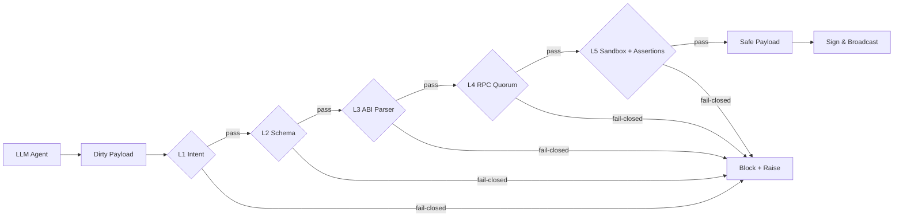
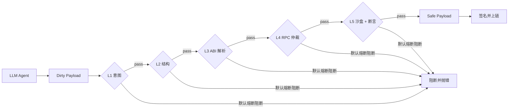

<div align="center">
  
  
  
  
</div>

<p align="center">
  <b>English</b> | <a href="#-简体中文-chinese-version">🇨🇳 简体中文</a> | <a href="#-quickstart">⚡ Quickstart</a> | <a href="#-installation">📦 Installation</a> | <a href="#-why-lirix">🎯 Why Lirix?</a> | <a href="#-project-layout">🗺️ Project Layout</a> | <a href="#-security-model">🛡️ Security Model</a> | <a href="#-support--faq">💬 Support / FAQ</a>
</p>

# Lirix: The Definitive Security Gateway for Web3 AI Agents

[](https://pypi.org/project/lirix/)
[](https://github.com/lokii-D/lirix/actions)

Lirix is a deterministic security boundary between untrusted AI output and on-chain execution. It blocks prompt injections, stale RPC reads, hallucinated contract paths, and toxic DeFi payloads before they can touch private keys, signing authority, or capital.

## ⚡ From Chaos to Determinism in 3 Lines of Code

```python
from lirix.core.builder import LirixTxBuilder

draft = (
    LirixTxBuilder("transfer(address,uint256)", ["0x000000000000000000000000000000000000dEaD", 1])
    # Reverts mathematically if post-trade delta < 25 USDC.
    .assert_erc20_balance_increase("0x0000000000000000000000000000000000000001", 25)
    .build()
)
```

L5 state assertions let you encode the expected post-trade delta directly into the execution plan. If the token balance does not increase by the asserted amount, the transaction fails closed.

## ⚡ Quickstart

```python
from typing import Any

from lirix import Lirix, LirixSecurityException

# Type hints are first-class: your IDE can infer the security boundary.
guardian: Lirix = Lirix(rpc_urls=["https://eth-mainnet..."])

raw_llm_output: str = 'swap 1 ETH for USDC on Uniswap V3'

try:
    # This triggers the L1-L5 Shield: Validate -> Parse -> Simulate -> Assert.
    # Lirix validates intent, parses calldata, and simulates execution.
    # The returned safe_payload is intentionally separated from signing authority.
    safe_payload = guardian.validate_and_simulate(raw_llm_output, intent="swap")
    sign_and_broadcast(safe_payload)  # Your app signs; Lirix never touches private keys.
except LirixSecurityException as exc:
    # Fail-closed by design: the agent gets a precise remediation hint.
    print(exc.resolution_for_agent)
```

## ⚡ Installation

It is strongly recommended to install Lirix inside a virtual environment to avoid OS-level package conflicts (PEP 668).

```bash
# 1. Create and activate a virtual environment
python3 -m venv venv
source venv/bin/activate  # On Windows use: venv\Scripts\activate

# 2. Install Lirix
pip install lirix
```

## 🎯 Why Lirix?

AI agents fail in predictable ways: they invent addresses, trust stale state, overfit to a single RPC node, and route users into honeypots or extreme slippage. Lirix exists to fail closed under those conditions.

- **Deterministic intent arbitration** — Lirix converts raw model text into explicit, validated execution intent instead of trusting language that merely sounds plausible.
- **Fail-closed execution boundary** — unsafe output is blocked before signing, not “warned about” after the fact.
- **Quorum-grade state validation** — v1.3.0 introduces **L4 Multi-RPC Quorum**, which diffs state across nodes to reject stale, inconsistent, or MEV-vulnerable reads.
- **Post-execution state proofs** — v1.3.0 introduces **L5 State Delta Assertions**, including fluent checks like `.assert_erc20_balance_increase()`, so you can prove the outcome mathematically rather than infer it from calldata alone.
- **Omnichain readiness** — the built-in Intent Registry prepares Lirix for cross-chain routing paths, including Wormhole and LayerZero style flows, without weakening the local trust boundary.
- **No private-key exposure** — Lirix validates and simulates; your application signs. That separation is not a convenience feature. It is the security model.

## 🛡️ The 5-Layer Security Shield



Lirix enforces a ruthless boundary between AI intent and chain execution:

1. **L1 Intent Auditing**: Intercepts prompt injections by matching model output against a strict intent whitelist.
2. **L2 Schema Boundaries**: Pydantic v2 strict typing eliminates malformed payloads and impossible values before execution begins.
3. **L3 DeFi Deep Parsing**: Penetrates nested router calldata, multicalls, and aggregator payloads to stop supply-chain poisoning at the ABI layer.
4. **L4 Multi-RPC Quorum**: Async multi-node state diffing and circuit-breaker logic block stale, inconsistent, or MEV-sensitive reads before they influence execution.
5. **L5 State-Aware Execution Layer**: Runs the transaction in a zero-gas local EVM sandbox, intercepts reverts, and uses **State Delta Assertions** to verify post-execution state mathematically. In v1.3.0, fluent checks like `.assert_erc20_balance_increase()` let you encode the expected outcome directly into the transaction plan, killing DeFi honeypots, 100% tax tokens, and extreme slippage by default when the asserted balance delta is not met.

## 🔌 Extensible Hook System

Built for enterprise-grade extensibility without contaminating the open-source core. `HookManager` gives teams a non-invasive insertion point for custom RBAC, cloud sandboxes, policy engines, and observability pipelines.

Use hooks when you need to:

- Enforce organization-specific authorization policies
- Route sensitive flows into isolated cloud sandboxes
- Export execution traces to OTel or internal observability stacks
- Add preflight and postflight controls without forking the core security model

The design principle is simple: the kernel stays deterministic, while the perimeter remains customizable.

## 🗺️ Project Layout

A compressed view of the repo:

```text
lirix/
├── lirix/        # core defense layers
├── tests/        # verification and adversarial coverage
├── docs/         # audit and architecture references
└── SECURITY.md   # disclosure policy and zero-trust rules
```

For the full structure and safety notes, see **[docs/STRUCTURE.md](docs/STRUCTURE.md)**.

The boundary is intentional: **Layers** stay in the core package, while **Audit** lives in docs and policies.

## 🛡️ Security Model

The Lirix Triple-Zero Standard is simple: **Zero-Key, Zero-Telemetry, Zero-Trust**.

In one sentence: Lirix never handles private keys, never emits telemetry, and never assumes untrusted AI output is safe.

🔒 Read the full policy in **[SECURITY.md](SECURITY.md)**.

## ☠️ Before Lirix (Vulnerable)

```python
# AI agent blindly trusts the model output.
# Funds get drained. Rekt.
multicall = ai_agent.generate("swap and stake everything")
sign_and_broadcast(multicall)  # malicious payload slips through
```

## 🛡️ After Lirix (Bulletproof)

```python
from lirix import Lirix, LirixSecurityException

guardian = Lirix(rpc_urls=["https://eth-mainnet..."])
raw = ai_agent.generate("swap and stake everything")

try:
    safe_payload = guardian.validate_and_simulate(raw, intent="swap")
    sign_and_broadcast(safe_payload)
except LirixSecurityException as exc:
    agent_message = exc.resolution_for_agent
    ai_agent.rewrite_intent(agent_message)
```

## 🔌 Native Integrations (LangChain / AutoGen)

```python
from langchain.tools import tool
from lirix import Lirix

guardian = Lirix(rpc_urls=["https://eth-mainnet..."])

@tool("lirix_validate_and_simulate")
def lirix_validate_and_simulate(raw_llm_output: str, intent: str) -> str:
    """Validate AI output through Lirix before any on-chain action."""
    payload = guardian.validate_and_simulate(raw_llm_output, intent=intent)
    return payload.model_dump_json()
```

Lirix is the official gateway for Web3-capable agents: wrap it once, and every downstream tool call inherits the same security boundary.

## 📜 Audit Log Preview

```json
{
  "timestamp": "2026-04-19T12:34:56.789Z",
  "service": "lirix",
  "severity": "WARN",
  "error_code": "LIRIX-L1-INTENT_DENIED",
  "actor": {
    "address": "0x8f3A12cE9dA4bF0D7e1E2C5dF7aA11b2C3D4e5F6A",
    "role": "untrusted_agent"
  },
  "context": "[REDACTED]",
  "payload_hash": "sha256:9f3c...e11d",
  "decision": "blocked",
  "reason": "Prompt injection pattern detected in nested multicall route",
  "resolution_for_agent": "Rewrite intent to a single authorized swap action with explicit token pair and slippage bounds"
}
```

## What Lirix Actually Does

Lirix is a security boundary, not a wallet. It validates untrusted LLM output, parses DeFi payloads, simulates execution, and hands your application a safe payload to sign and broadcast.

### Typical Flow

1. The agent proposes an action.
2. Lirix audits the intent and schema.
3. Lirix parses nested calldata and validates the execution path.
4. Lirix runs a zero-gas simulation against quorum-verified RPC state.
5. Your application signs the returned payload and broadcasts it.

## 💬 Support / FAQ

- General questions and feature ideas: open a thread in **[GitHub Discussions](https://github.com/lokii-D/lirix/discussions)** or file a standard issue in **[GitHub Issues](https://github.com/lokii-D/lirix/issues)**.
- Security vulnerabilities: **do not open an Issue**. Follow the private disclosure flow in **[SECURITY.md](SECURITY.md)**.

### FAQ

**Q: Why doesn’t Lirix need my private key?**

A: Because Lirix is a gatekeeper, not a signer. It validates intent and simulates execution, then returns a safe payload to your application. Your application retains the private key and signing authority; that separation is the whole security model.

### FAQ / Troubleshooting (PEP 668)

**Q: I got an `externally-managed-environment` error when running `pip install`.**

A: This is a modern OS protection feature (PEP 668). Do not use `--break-system-packages`. Create a virtual environment (`python3 -m venv venv`) and activate it before installing Lirix.

## Development Requirements

- Python 3.8–3.14
- `black`
- `ruff`
- `mypy`
- `pytest`
- **Foundry / Anvil** for L5 integration tests

### Local Test Environment

To run the full local suite, install the Python tooling and Foundry first. L5 integration tests depend on Anvil because Lirix’s zero-gas sandbox needs a local EVM simulation backend.

```bash
pip install -e ".[dev]"

# Install Foundry
curl -L https://foundry.paradigm.xyz | bash
foundryup

# Start Anvil in a separate terminal if your test workflow expects a live node
anvil
```

Recommended verification sequence:

```bash
black .
ruff check .
mypy .
pytest
```

If your environment exercises the L5 path, ensure Anvil is running and reachable before executing the integration tests.

## License

MIT — see `LICENSE`.

---

<h1 id="-简体中文-chinese-version">🇨🇳 Lirix：Web3 AI Agent 的终极安全前置网关</h1>

Lirix 是不可信 AI 输出与链上执行之间的确定性安全边界。它会在提示词越狱注入、陈旧 RPC 读取、幻觉式合约路径与有毒 DeFi 负载触达私钥、签名权或资金之前，先行拦截。

## ⚡ 三行代码，将混沌转化为确定性

```python
from lirix.core.builder import LirixTxBuilder

draft = (
    LirixTxBuilder("transfer(address,uint256)", ["0x000000000000000000000000000000000000dEaD", 1])
    # 若交易后差值未达预期，将在沙盒内被确定性阻断并回滚。
    .assert_erc20_balance_increase("0x0000000000000000000000000000000000000001", 25)
    .build()
)
```

L5 状态差值断言允许你把预期的交易后状态差值直接写进执行计划。如果代币余额没有按断言值增加，交易就会默认熔断阻断。

## ⚡ 快速开始

```python
from typing import Any

from lirix import Lirix, LirixSecurityException

# 类型提示是第一等公民：IDE 可以直接理解安全边界。
guardian: Lirix = Lirix(rpc_urls=["https://eth-mainnet..."])

raw_llm_output: str = '在 Uniswap V3 上将 1 ETH 兑换为 USDC'

try:
    # 触发 L1-L5 全栈防御：校验 -> 解析 -> 模拟 -> 断言。
    # Lirix 会校验意图、解析 calldata，并执行模拟试爆。
    # 返回的 safe_payload 与签名权严格分离，表示“可安全签名”，而不是“自动签名”。
    safe_payload = guardian.validate_and_simulate(raw_llm_output, intent="swap")
    sign_and_broadcast(safe_payload)  # 仍由你的应用完成签名与广播。
except LirixSecurityException as exc:
    # 默认熔断阻断：把精确的修正建议返回给 Agent，而不是放行危险执行。
    print(exc.resolution_for_agent)
```

## ⚡ 安装

强烈建议在虚拟环境中安装 Lirix，以避免操作系统级包冲突（PEP 668）。

```bash
# 1. 创建并激活虚拟环境
python3 -m venv venv
source venv/bin/activate  # Windows 使用：venv\Scripts\activate

# 2. 安装 Lirix
pip install lirix
```

## 🎯 为什么选择 Lirix？

AI Agent 的失效方式是可预测的：它会编造地址、相信陈旧状态、过度依赖单一 RPC 节点，并把用户路由进貔貅盘或极端滑点。Lirix 的存在，就是要在这些条件下默认熔断阻断。

- **确定性意图仲裁** — Lirix 把原始模型文本转化为显式、可验证的执行意图，而不是相信那些“看起来像对的”语言。
- **默认熔断阻断的执行边界** — 危险输出会在签名前被拦截，而不是事后才“提示风险”。
- **共识级状态校验** — v1.3.0 引入 **L4 多源 RPC 共识仲裁**，通过跨节点状态差分，拒绝陈旧、不一致或易遭 MEV 夹击的读数。
- **执行后状态证明** — v1.3.0 引入 **L5 状态差值断言**，包括 `.assert_erc20_balance_increase()` 这类流式 API，让你用数学方式证明结果，而不是只从 calldata 推测。
- **全链路由就绪（Omnichain Readiness）** — 内置的 Intent Registry 为跨链路由做准备，兼容 Wormhole、LayerZero 风格流程，同时不削弱本地信任边界。
- **不暴露私钥** — Lirix 负责校验与试爆；你的应用负责签名。这个分工不是便利性设计，而是安全模型本身。

## 🛡️ 五层安全防线



Lirix 在 AI 意图与链上执行之间，构建了毫不妥协的边界：

1. **L1 意图审计**：通过严格的白名单比对，拦截提示词越狱注入。
2. **L2 结构边界**：Pydantic v2 强类型校验，在执行前消除格式错误的 payload 与不可能值。
3. **L3 DeFi 深度解析**：穿透嵌套路由、multicall 与聚合器负载，在 ABI 层截断供应链投毒。
4. **L4 多源 RPC 共识仲裁**：异步多节点状态差分与断路器逻辑，在执行前阻断陈旧、不一致或易遭 MEV 夹击的脏数据。
5. **L5 状态感知执行层**：在零 Gas 的本地 EVM 沙盒中执行交易，拦截回滚，并通过**状态差值断言**对执行后的状态进行数学化验证。v1.3.0 中，诸如 `.assert_erc20_balance_increase()` 这样的流式 API，可以把预期结果直接写进交易计划；当断言的余额差值未被满足时，系统会默认熔断阻断，从而击穿 DeFi 貔貅盘与杀猪税代币，以及极端滑点路径。

## 🔌 可扩展 Hook 系统

它为企业级扩展而生，同时不会污染开源核心。`HookManager` 提供了一个非侵入式挂载点，可接入自定义 RBAC、云端沙盒、策略引擎与观测管线。

当你需要以下能力时，可以使用 Hook：

- 强制执行组织级授权策略
- 将敏感流程路由到隔离云沙盒
- 将执行轨迹导出到 OTel 或内部可观测平台
- 在不 Fork 核心安全模型的前提下添加前置与后置控制

设计原则很简单：内核保持确定性，外围保持可定制。

## 🗺️ 项目布局

压缩视图如下：

```text
lirix/
├── lirix/        # 核心防线 layers
├── tests/        # 验证与对抗覆盖
├── docs/         # 审计与架构资料
└── SECURITY.md   # 安全披露与零信任规则
```

完整结构与安全说明请查看 **[docs/STRUCTURE.md](docs/STRUCTURE.md)**。

边界是刻意设计的：**Layers** 留在核心包中，**Audit** 归入文档与政策。

## 🛡️ 安全模型

Lirix Triple-Zero Standard 很简单：**零密钥、零遥测、零信任**。

一句话概括：Lirix 永不处理私钥，永不发出遥测数据，也绝不默认不可信 AI 输出是安全的。

🔒 完整策略见 **[SECURITY.md](SECURITY.md)**。

## ☠️ Lirix 之前（存在风险）

```python
# AI Agent 盲目信任模型输出。
# 资金被盗（Rekt）。
multicall = ai_agent.generate("swap and stake everything")
sign_and_broadcast(multicall)  # 恶意 payload 直接穿透
```

## 🛡️ Lirix 之后（刀枪不入）

```python
from lirix import Lirix, LirixSecurityException

guardian = Lirix(rpc_urls=["https://eth-mainnet..."])
raw = ai_agent.generate("swap and stake everything")

try:
    safe_payload = guardian.validate_and_simulate(raw, intent="swap")
    sign_and_broadcast(safe_payload)
except LirixSecurityException as exc:
    agent_message = exc.resolution_for_agent
    ai_agent.rewrite_intent(agent_message)
```

## 🔌 原生生态接入（LangChain / AutoGen）

```python
from langchain.tools import tool
from lirix import Lirix

guardian = Lirix(rpc_urls=["https://eth-mainnet..."])

@tool("lirix_validate_and_simulate")
def lirix_validate_and_simulate(raw_llm_output: str, intent: str) -> str:
    """在任何链上动作之前，先由 Lirix 完成校验。"""
    payload = guardian.validate_and_simulate(raw_llm_output, intent=intent)
    return payload.model_dump_json()
```

Lirix 是 Web3 AI Agent 进入生产环境时的官方安全网关：一次封装，所有下游工具调用都继承同一条安全边界。

## 📜 审计日志预览

```json
{
  "timestamp": "2026-04-19T12:34:56.789Z",
  "service": "lirix",
  "severity": "WARN",
  "error_code": "LIRIX-L1-INTENT_DENIED",
  "actor": {
    "address": "0x8f3A12cE9dA4bF0D7e1E2C5dF7aA11b2C3D4e5F6A",
    "role": "untrusted_agent"
  },
  "context": "[REDACTED]",
  "payload_hash": "sha256:9f3c...e11d",
  "decision": "blocked",
  "reason": "Prompt injection pattern detected in nested multicall route",
  "resolution_for_agent": "Rewrite intent to a single authorized swap action with explicit token pair and slippage bounds"
}
```

## Lirix 的真实职责

Lirix 是安全边界，不是钱包。它校验不可信的 LLM 输出，解析 DeFi 负载，模拟执行，并将可安全签名与广播的 payload 交还给你的应用。

### 典型流程

1. Agent 提出动作意图。
2. Lirix 审计意图与结构。
3. Lirix 解析嵌套 calldata 并验证执行路径。
4. Lirix 基于共识通过的 RPC 状态执行零 Gas 确定性试爆。
5. 你的应用签名返回的 payload 并完成广播。

## 💬 支持 / 常见问题

- 常规问题与功能建议：请在 **[GitHub Discussions](https://github.com/lokii-D/lirix/discussions)** 发起讨论，或到 **[GitHub Issues](https://github.com/lokii-D/lirix/issues)** 提交标准问题。
- 安全漏洞：**严禁提交 Issue**。请直接遵循 **[SECURITY.md](SECURITY.md)** 中的私密披露通道。

### FAQ

**问：为什么 Lirix 不需要我的私钥？**

答：因为 Lirix 是门禁，不是签名器。它只负责校验意图与模拟执行，然后把一个可安全签名的 payload 交回给你的应用。私钥和签名权始终保留在你的系统里——这就是整个安全模型的核心。

### FAQ / 故障排查（PEP 668）

**问：运行 `pip install` 时出现了 `externally-managed-environment` 错误。**

答：这是现代操作系统的保护机制（PEP 668）。请不要使用 `--break-system-packages`。应先创建虚拟环境（`python3 -m venv venv`），再激活后安装 Lirix。

## 开发环境要求

- Python 3.8–3.14
- `black`
- `ruff`
- `mypy`
- `pytest`
- **Foundry / Anvil**：用于 L5 集成测试

### 本地测试环境

要运行完整的本地测试套件，请先安装 Python 工具链和 Foundry。L5 集成测试依赖 Anvil，因为 Lirix 的零 Gas 沙盒需要本地 EVM 模拟后端。

```bash
pip install -e ".[dev]"

# 安装 Foundry
curl -L https://foundry.paradigm.xyz | bash
foundryup

# 如果你的测试流程依赖实时节点，请在另一个终端中启动 Anvil
anvil
```

推荐的校验顺序：

```bash
black .
ruff check .
mypy .
pytest
```

如果你的环境会执行 L5 路径，请在运行集成测试前确认 Anvil 已启动并可访问。

## 许可证

MIT —— 见 `LICENSE`。
