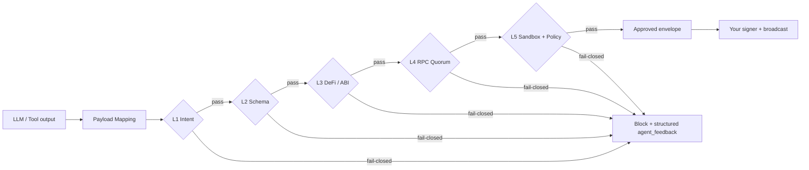
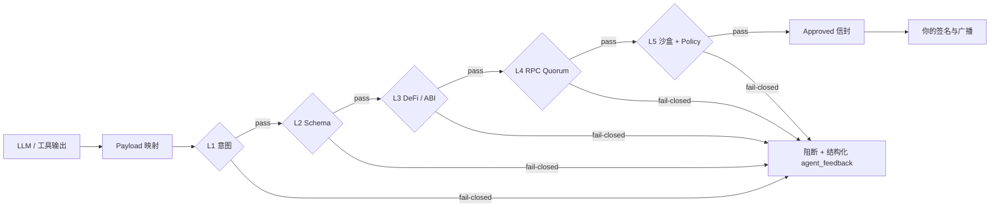

<div align="center">
  <a href="https://pypi.org/project/lirix/"></a>
  
  
  
</div>

<p align="center">
  <b>English</b> | <a href="#-简体中文-chinese-version">🇨🇳 简体中文</a> | <a href="docs/migration_legacy_to_v2.md">Migration</a> | <a href="#-installation--setup">📦 Installation</a> | <a href="#-quickstart-five-minute-blitz">⚡ Quickstart</a> | <a href="#-ecosystem-integrations-langchain--autogen">🌐 Integrations</a> | <a href="#-architecture--security-trace">🏗️ Architecture</a> | <a href="#-support--faq">💬 Support</a> | <a href="CONTRIBUTING.md">🛠️ Contributing</a> | <a href="SECURITY.md">🛡️ Security</a> | <a href="CODE_OF_CONDUCT.md">⚔️ Conduct</a> | <a href="LICENSE">📜 License</a>
</p>

**Current version:** **v2.0.4** — edit **`[project].version`** in `pyproject.toml` only; `lirix.__version__` and this README follow that anchor.

> **🏆 Hackathon judges — start here:** [`README_submission.md`](./mantle_TT/README_submission.md) · [Live demo](https://huggingface.co/spaces/lokiii07/lirix-mantle-harness) · `./scripts/full_dry_run.sh` · Evidence: [`mantle_TT/external_evidence.md`](./mantle_TT/external_evidence.md)

## Mantle DoraHacks 2026 (harness branch)

**Judges:** [`mantle_TT/README_submission.md`](./mantle_TT/README_submission.md) — 30 sec · 2 min · 3 min landing page → `./scripts/full_dry_run.sh`

| Resource | Link |
| --- | --- |
| **HF Spaces demo** | https://huggingface.co/spaces/lokiii07/lirix-mantle-harness |
| **Contract (Mantle Sepolia)** | [`0x844cd69eADcc097F759FBf76C2d9735A55A9635c`](https://sepolia.mantlescan.xyz/address/0x844cd69eADcc097F759FBf76C2d9735A55A9635c) |
| **On-chain proof tx** | [`0xa23bb06a…b055a`](https://sepolia.mantlescan.xyz/tx/0xa23bb06ad14518ea7418082caef761cf864548a6705e8a2682b08c6cd69b055a) |
| **Screenshots** | [`docs/submission_assets/`](docs/submission_assets/) (5 verified PNGs) |
| **Sepolia RPC** | `https://rpc.sepolia.mantle.xyz` |
| **Demo video** | https://youtu.be/16Oa0ur-NFk |
| **Harness branch** | https://github.com/lokii-D/lirix/tree/mantle-turing-2026-harness |

> **Reading order:** value proposition → installation → quickstart → architecture (overview) → security and support. The Chinese section mirrors this order. Contract fields, version, and gate semantics are single-sourced — see **Document layers** below; do not restate them in both languages differently.

# Lirix 2.0 · The EVM-grade execution airlock for AI agents

[](https://pypi.org/project/lirix/)
[](https://github.com/lokii-D/lirix/actions)

**Lirix is a fail-closed validation and simulation control plane that stands between untrusted agent payloads and anything that can move value.** It is not a signer; it is the execution airlock that forces intent, schema, ABI, RPC evidence, and local EVM simulation through L1–L5 before any broadcast handoff is emitted.

## 🧭 At a glance

- **Start here** — the value proposition explains the problem Lirix solves.
- **Then install** — the recommended setup path keeps environments clean and reproducible.
- **Then run quickstart** — a five-minute walkthrough shows the approved handoff.
- **Then inspect the architecture** — the control-plane model explains how the layers fit together.
- **Then read security and support** — the boundary rules and contributor norms are explicit.

That sequence is deliberate: it matches how first-time visitors decide whether to trust, try, and then adopt a project.

## 🎯 Why Lirix?

The Web3 agent stack fails in predictable ways: prompt injection becomes malicious calldata, toxic DeFi shapes pass review but fail on-chain, proxies hide real code paths, and RPC views diverge under load. Lirix collapses that attack surface into a single deterministic DAG: validate intent, decode and pierce contracts, reconcile RPC evidence, simulate with state overrides, and only then return an evidence-rich envelope that your orchestrator can retry, rewrite, or reject without guessing.

## ✨ What you get

- **Fail-closed by design** — blocked requests stay blocked unless every gate passes.
- **Evidence-first output** — every approval carries structured feedback and replay-friendly artifacts.
- **Agent-friendly integration** — a single control plane for LLM tools, signers, and orchestrators.
- **Production-oriented guardrails** — architecture, tests, and docs are tied together by SSOT links.

## 📚 Document layers (do not treat this file as contract SSOT)

| Layer | Document | Use for |
| --- | --- | --- |
| **Navigation** | `README.md` (this file) | Value prop, install, quickstart, links |
| **Audit index** | `docs/audit_path_map.md` | Assertions → code → tests → evidence → CI; **`l1_l3_ok` / full-pipeline revalidation** |
| **Control plane** | `docs/architecture_control_plane.md` | Assertion ↔ evidence-key table (links audit map for gate semantics) |
| **API contract** | `docs/api_reference.md` + `tests/` | Stable keys, behavior, integrator surface |
| **Pipeline order** | `docs/pipeline_evidence_flow.md` | Stage order for `validate_and_simulate` |
| **CI / gates** | `docs/ci_gate_matrix.md`, `.github/workflows/` | Workflow truth |
| **Exclusions** | `docs/repo_exclusions.md` | `.gitignore` / `.harnessignore` / pytest alignment |
| **Security** | `SECURITY.md` | Disclosure and trust boundary |

**Bilingual rule:** English and Chinese below share the same contract intent. Change version, gate, or evidence claims in **one** place (`pyproject.toml`, `docs/audit_path_map.md`, or the SSOT doc for that topic), then mirror wording in both languages — no independent paraphrase of normative semantics.

If this README conflicts with code, tests, or SSOT docs, **the SSOT docs and code win**.

**PyPI maturity:** `Development Status :: 5 - Production/Stable` on the **2.x** line; breaking cadence: `docs/migration_legacy_to_v2.md`. **Migration shims** (`DeprecationWarning`, legacy config aliases) are documented compatibility only — see `docs/release_notes.md`.

## 📦 Installation & Setup

If you are new, use the recommended path below. If you are upgrading, skim the migration note first.

### Recommended path

```bash
python3 -m venv .venv
source .venv/bin/activate  # Windows: `.venv\\Scripts\\activate`
pip install lirix
lirix init
```

### If you are upgrading from an older line

Read `docs/migration_legacy_to_v2.md` before changing imports, config aliases, or release assumptions. The migration guide is the source of truth for compatibility windows and breaking-change timing.

### What to expect after install

Lirix is designed to fail closed. If the boundary cannot be verified with enough confidence, the result is rejection rather than speculation.

## ⚡ Quickstart: Five-Minute Blitz

The fastest path is intentionally linear: validate, inspect the handoff, then triage failures. If you only copy one section, copy this one.

### 1) Fail-closed validation and simulation

```python
from typing import Any, Mapping

from lirix import Lirix

guardian = Lirix(rpc_urls=["https://eth-mainnet.g.alchemy.com/v2/…"])
draft: Mapping[str, Any] = {
    "to": "0x0000000000000000000000000000000000000001",
    "data": "0x",
    "value": 0,
}
result = guardian.validate_and_simulate("swap", draft)
print(result["decision"], result["status"], result["agent_feedback"]["reason_code"])
print(result["payload"].get("simulation_ok"))
```

### 2) Extract the broadcast handoff

Use **`Lirix.extract_broadcast_fields(result)`** only after both `decision` and `status` are `"approved"`. The signer should receive the extracted broadcast fields, not the full result envelope.

```python
from lirix import Lirix

if result.get("decision") == "approved" and result.get("status") == "approved":
    broadcast_fields = Lirix.extract_broadcast_fields(result)
    # Sign and broadcast using broadcast_fields only.
else:
    rc = (result.get("agent_feedback") or {}).get("reason_code")
    print(
        f"Validation failed: decision={result.get('decision')!r} "
        f"status={result.get('status')!r} reason_code={rc!r}"
    )
```

### 3) Failure triage

When a request is blocked, inspect **`agent_feedback.remediation`**, then **`agent_feedback.reason_code`**, then resolve the protocol with **`resolve_failure_protocol(...)`** or **`Lirix.resolve_failure_protocol(...)`**. Stable audit fields include **`canonical_error_code`**, **`failure_type_canonical`**, **`canonical_reason_codes`**, and the replay-facing aliases inside **`forensic_bundle`**.

For recovery order and audit fields (`canonical_error_code`, `failure_type_canonical`, `canonical_reason_codes`, `forensic_bundle`), use **`docs/audit_path_map.md`** and **`docs/api_reference.md`** — not extended narrative here.

### 4) E2E regression mirror

```bash
pytest -q tests/test_integration/test_real_e2e_paths.py
```

## 🌐 Ecosystem Integrations (LangChain & AutoGen)

Use these patterns when Lirix sits between model output and a downstream signer or executor.

**Rule:** `validate_and_simulate` takes `intent: str` and `payload: Mapping[str, Any]`. Always schema-lock model output before it crosses the Lirix boundary.

### LangChain

```python
from __future__ import annotations

import json
from typing import Any, Mapping, cast

from langchain_core.tools import tool
from pydantic import BaseModel, ConfigDict, Field

from lirix import Lirix, LirixSecurityException


class LirixValidationRequest(BaseModel):
    model_config = ConfigDict(extra="forbid", str_strip_whitespace=True)

    raw_llm_output: str = Field(..., min_length=1)
    intent: str = Field(..., min_length=1)


class LirixSecurityValidator:
    def __init__(self, guardian: Lirix) -> None:
        self._guardian = guardian

    def validate(self, raw_llm_output: str, intent: str) -> str:
        draft = cast(Mapping[str, Any], json.loads(raw_llm_output))
        # 先做结构化反序列化，再交给 Lirix 执行 fail-closed 校验与模拟
        result = self._guardian.validate_and_simulate(intent, draft)
        if result.get("decision") != "approved" or result.get("status") != "approved":
            rc = (result.get("agent_feedback") or {}).get("reason_code")
            return json.dumps(
                {"result": result, "tx_payload": None, "reason_code": rc},
                sort_keys=True,
                default=str,
            )
        try:
            tx_payload = Lirix.extract_broadcast_fields(result)
        except LirixSecurityException as exc:
            return json.dumps(
                {"result": result, "tx_payload": None, "resolution_for_agent": exc.resolution_for_agent},
                sort_keys=True,
                default=str,
            )
        return json.dumps({"result": result, "tx_payload": tx_payload}, sort_keys=True, default=str)


guardian = Lirix(rpc_urls=["https://eth-mainnet.g.alchemy.com/v2/…"])
validator = LirixSecurityValidator(guardian=guardian)


@tool("lirix_validate_and_simulate")
def lirix_validate_and_simulate(raw_llm_output: str, intent: str) -> str:
    """在任何广播路径前进行 fail-closed 校验。"""
    return validator.validate(raw_llm_output=raw_llm_output, intent=intent)
```

### AutoGen

```python
from __future__ import annotations

import json
from dataclasses import dataclass
from typing import Any, Mapping, cast

from lirix import Lirix, LirixSecurityException


@dataclass(frozen=True)
class AutoGenLirixBridge:
    guardian: Lirix

    def __call__(self, raw_llm_output: str, intent: str) -> Mapping[str, Any]:
        draft = cast(Mapping[str, Any], json.loads(raw_llm_output))
        result = self.guardian.validate_and_simulate(intent, draft)
        if result.get("decision") != "approved" or result.get("status") != "approved":
            rc = (result.get("agent_feedback") or {}).get("reason_code")
            return {"status": "blocked", "result": result, "reason_code": rc}
        try:
            tx_payload = Lirix.extract_broadcast_fields(result)
        except LirixSecurityException as exc:
            return {"status": "blocked", "resolution_for_agent": exc.resolution_for_agent}
        return {"status": "approved", "result": result, "tx_payload": tx_payload}


autogen_lirix = AutoGenLirixBridge(guardian=Lirix(rpc_urls=["https://eth-mainnet.g.alchemy.com/v2/…"]))
```

## 🏗️ Architecture & Security Trace

Compressed overview only — assertion tables and gate semantics live in **`docs/architecture_control_plane.md`** and **`docs/audit_path_map.md`**.

Public **`Lirix`** (`lirix/_facade.py`) composes **`HookManager`**, **`ClientPipelineProtocol`**, and **`LirixPipelineOrchestrator`** into a one-way pipeline. Hooks extend policy at the perimeter; they do not bypass the core.



1. **L1** — Intent firewall with injection-resistant allowlists.
2. **L2** — Schema boundary with strict payload typing.
3. **L3** — DeFi / ABI decoding plus proxy piercing.
4. **L4** — Multi-node RPC reconciliation with evidence.
5. **L5** — Local EVM simulation plus shadow policy audit.

`HookManager` gives you RBAC, sandbox routing, OTel export, and pre/post-flight policy hooks without forking the kernel. The rule is simple: the kernel stays deterministic; the perimeter stays customizable.

### Developer paths

- **`validate_only` / `async_validate_only`** — L1–L3 + evidence.
- **`simulate_only` / `async_simulate_only`** — L4–L5, with optional prior validation gate.
- **`validate_and_simulate` / `async_validate_and_simulate`** — full DAG.
- **`atomic_multicall`** — multicall packing with L1–L3 alignment.
- **Layer types** — prefer **`from lirix import HookManager, ProxyPiercer, RPCManager, SandboxSimulator`**; use **`lirix.layers`** / **`lirix.core`** when you need the full catalog (e.g. `ShadowAuditor`, `MulticallEncoder`).

### Full pipeline order (`validate_and_simulate` / `async_validate_and_simulate`)

**Stage order:** [`docs/pipeline_evidence_flow.md`](docs/pipeline_evidence_flow.md). **`l1_l3_ok` and post–`HOOK_PRE_SIMULATION` L1–L3 revalidation:** [`docs/audit_path_map.md` § Session gate semantics](docs/audit_path_map.md#session-gate-semantics-l1_l3_ok) only.

### Progressive migration flags

`LirixConfig` exposes **`hook_contract_mode`**, **`policy_lifecycle_mode`**, and **`rpc_evidence_mode`**. Move `hook_contract_mode` from **`shadow`** to **`enforce`** only after the hook evidence is clean and the v2 rails are verified.

### Project layout

```text
lirix/
├── lirix/        # core defense layers + facade
├── tests/        # verification + adversarial coverage
├── docs/         # audit + architecture SSOT
└── SECURITY.md   # disclosure policy
```

Full tree: **`docs/STRUCTURE.md`**. Control plane table: **`docs/architecture_control_plane.md`**.

## 🛡️ Security Model

This repository’s trust boundary is intentionally narrow.

**Triple-Zero:** **Zero-Key · Zero-Telemetry · Zero-Trust** — see **`SECURITY.md`**. If a request cannot be verified with high confidence, Lirix rejects it rather than guessing.

## 💬 Support & FAQ

Use the support paths below after you have read the contract and the quickstart. Clear docs, narrow boundaries, and reproducible behavior are the preferred way to keep support useful.

- **General:** [Discussions](https://github.com/lokii-D/lirix/discussions) / [Issues](https://github.com/lokii-D/lirix/issues)
- **Security:** do **not** open public issues; follow **`SECURITY.md`**.
- **Contributor norms:** follow **`CONTRIBUTING.md`** and **`CODE_OF_CONDUCT.md`** before opening a PR or joining the conversation.

**Q: Why no private key?**<br>
A: Lirix validates and simulates; **you** sign. Separation of duties is the model.

**Q: `externally-managed-environment`?**<br>
A: Use a venv; never `pip install --break-system-packages`.

**Q: Where should I read first?**<br>
A: Start with the value proposition, then installation, then quickstart, then architecture, then security. The Chinese section below follows the same order.

---

<h1 id="-简体中文-chinese-version">🇨🇳 Lirix 2.0 · 面向 AI Agent 的 EVM 级执行气闸</h1>

**一句话定义：** Lirix 是夹在「不可信模型输出」与「私钥 / 广播」之间的 **fail-closed 校验 + 模拟控制平面**。它不是钱包，也不是 Signer；它是 **EVM-grade execution airlock**，要求意图、Payload、RPC 证据与本地 EVM 模拟逐层通过 **L1–L5 单向 DAG**，然后才吐出可交接的广播字段。

**当前版本：v2.0.4** — 仅改 `pyproject.toml` 中 `[project].version`；`lirix.__version__` 与上文英文版本行与之对齐。

> **🏆 评委入口：** [`README_submission.md`](./README_submission.md) · [在线演示](https://huggingface.co/spaces/lokiii07/lirix-mantle-harness) · `./scripts/full_dry_run.sh` · 证据链：[`mantle_TT/external_evidence.md`](./mantle_TT/external_evidence.md)

## Mantle DoraHacks 2026（harness 分支）

评委入口：[`mantle_TT/README_submission.md`](./mantle_TT/README_submission.md)（30 秒 · 2 分钟 · 3 分钟路径）→ `./scripts/full_dry_run.sh`

| 资源 | 链接 |
| --- | --- |
| **HF Spaces 演示** | https://huggingface.co/spaces/lokiii07/lirix-mantle-harness |
| **合约（Mantle Sepolia）** | [`0x844cd69eADcc097F759FBf76C2d9735A55A9635c`](https://sepolia.mantlescan.xyz/address/0x844cd69eADcc097F759FBf76C2d9735A55A9635c) |
| **链上证明 tx** | [`0xa23bb06a…b055a`](https://sepolia.mantlescan.xyz/tx/0xa23bb06ad14518ea7418082caef761cf864548a6705e8a2682b08c6cd69b055a) |
| **提交截图** | [`docs/submission_assets/`](docs/submission_assets/)（5 张已验证 PNG） |
| **Sepolia RPC** | `https://rpc.sepolia.mantle.xyz` |
| **演示视频** | https://youtu.be/16Oa0ur-NFk |
| **Harness 分支** | https://github.com/lokii-D/lirix/tree/mantle-turing-2026-harness |

## 📚 文档分层（本文件非契约 SSOT）

| 层级 | 文档 | 用途 |
| --- | --- | --- |
| **导航** | `README.md`（本节） | 价值、安装、快速上手、链接 |
| **审计索引** | `docs/audit_path_map.md` | 断言 → 代码 → 测试 → 证据 → CI；**`l1_l3_ok` / 全链路 L1–L3 复检** |
| **控制面** | `docs/architecture_control_plane.md` | 断言 ↔ 证据键表（门闩语义链至 audit map） |
| **API 契约** | `docs/api_reference.md` + `tests/` | 稳定键名与行为 |
| **流水线顺序** | `docs/pipeline_evidence_flow.md` | `validate_and_simulate` 阶段顺序 |
| **排除边界** | `docs/repo_exclusions.md` | `.gitignore` / `.harnessignore` 对齐 |

**双语维护：** 版本、门禁、证据字段以 SSOT 文档为准，中英文同步改写，勿各自意译规范语义。与代码或 SSOT 冲突时，**以 SSOT 与代码为准**。

## 🎯 为什么需要 Lirix？

Web3 Agent 的常见死法非常一致：**Prompt 注入** 变成恶意 calldata，**有毒 DeFi 形状** 在审查时看似合理、上线后却 Revert 或失血，**Proxy / Router** 把真实执行路径藏起来，RPC 视图还会在高压下分叉。Lirix 把这些风险压成一条确定性 DAG：先校验意图与结构，再做 ABI 解码与 Proxy 穿透，必要时进行多节点 RPC 对账，并配合 **State Overrides** 做沙盒模拟，最后输出带 **`security_trace`** 与 **`replay_bundle`** 的证据信封——由你的编排器决定重试、改写，还是直接硬拒绝。

## 📦 安装与初始化

如果你是新读者，直接按下面的推荐方式开始；如果你在升级，请先看 `docs/migration_legacy_to_v2.md`。

### 推荐方式

```bash
python3 -m venv .venv
source .venv/bin/activate  # Windows：`.venv\\Scripts\\activate`
pip install lirix
lirix init
```

## ⚡ 快速上手：五分钟闪电战

最短路径是线性的：先校验，再看交接字段，最后做失败分流。

### 1) fail-closed 校验与模拟

```python
from typing import Any, Mapping

from lirix import Lirix

guardian = Lirix(rpc_urls=["https://eth-mainnet.g.alchemy.com/v2/…"])
draft: Mapping[str, Any] = {
    "to": "0x0000000000000000000000000000000000000001",
    "data": "0x",
    "value": 0,
}
result = guardian.validate_and_simulate("swap", draft)
print(result["decision"], result["status"], result["agent_feedback"]["reason_code"])
print(result["payload"].get("simulation_ok"))
```

### 2) 提取广播交接字段

只有当 `decision` 与 `status` 都是 `"approved"` 时，才允许调用 **`Lirix.extract_broadcast_fields(result)`**。签名器只接收提取后的广播字段，绝不接收完整 result envelope。

```python
from lirix import Lirix

if result.get("decision") == "approved" and result.get("status") == "approved":
    broadcast_fields = Lirix.extract_broadcast_fields(result)
    # 仅将 broadcast_fields 交给签名器并广播。
else:
    rc = (result.get("agent_feedback") or {}).get("reason_code")
    print(
        f"校验未通过：decision={result.get('decision')!r} "
        f"status={result.get('status')!r} reason_code={rc!r}"
    )
```

### 3) 失败排查

被阻断时，按顺序查看 **`agent_feedback.remediation`**、**`agent_feedback.reason_code`**，再用 **`resolve_failure_protocol(...)`** 定位。审计字段与恢复顺序见 **`docs/audit_path_map.md`**、**`docs/api_reference.md`**（含 **`canonical_error_code`**、**`failure_type_canonical`**、**`canonical_reason_codes`**、**`forensic_bundle`**）。

### 4) E2E 回归镜像

```bash
pytest -q tests/test_integration/test_real_e2e_paths.py
```

## 🌐 生态集成（LangChain 与 AutoGen）

当 Lirix 夹在模型输出与下游签名器 / 执行器之间时，请使用以下模式。

**规则：** `validate_and_simulate` 只接受 `intent: str` 与 `payload: Mapping[str, Any]`。模型输出必须先做 JSON / schema-lock，再跨过 Lirix 边界。

### LangChain

```python
from __future__ import annotations

import json
from typing import Any, Mapping, cast

from langchain_core.tools import tool
from pydantic import BaseModel, ConfigDict, Field

from lirix import Lirix, LirixSecurityException


class LirixValidationRequest(BaseModel):
    model_config = ConfigDict(extra="forbid", str_strip_whitespace=True)

    raw_llm_output: str = Field(..., min_length=1)
    intent: str = Field(..., min_length=1)


class LirixSecurityValidator:
    def __init__(self, guardian: Lirix) -> None:
        self._guardian = guardian

    def validate(self, raw_llm_output: str, intent: str) -> str:
        draft = cast(Mapping[str, Any], json.loads(raw_llm_output))
        # 先做结构化反序列化，再交给 Lirix 执行 fail-closed 校验与模拟
        result = self._guardian.validate_and_simulate(intent, draft)
        if result.get("decision") != "approved" or result.get("status") != "approved":
            rc = (result.get("agent_feedback") or {}).get("reason_code")
            return json.dumps(
                {"result": result, "tx_payload": None, "reason_code": rc},
                sort_keys=True,
                default=str,
            )
        try:
            tx_payload = Lirix.extract_broadcast_fields(result)
        except LirixSecurityException as exc:
            return json.dumps(
                {"result": result, "tx_payload": None, "resolution_for_agent": exc.resolution_for_agent},
                sort_keys=True,
                default=str,
            )
        return json.dumps({"result": result, "tx_payload": tx_payload}, sort_keys=True, default=str)


guardian = Lirix(rpc_urls=["https://eth-mainnet.g.alchemy.com/v2/…"])
validator = LirixSecurityValidator(guardian=guardian)


@tool("lirix_validate_and_simulate")
def lirix_validate_and_simulate(raw_llm_output: str, intent: str) -> str:
    """在任何广播路径前进行 fail-closed 校验。"""
    return validator.validate(raw_llm_output=raw_llm_output, intent=intent)
```

### AutoGen

```python
from __future__ import annotations

import json
from dataclasses import dataclass
from typing import Any, Mapping, cast

from lirix import Lirix, LirixSecurityException


@dataclass(frozen=True)
class AutoGenLirixBridge:
    guardian: Lirix

    def __call__(self, raw_llm_output: str, intent: str) -> Mapping[str, Any]:
        draft = cast(Mapping[str, Any], json.loads(raw_llm_output))
        result = self.guardian.validate_and_simulate(intent, draft)
        if result.get("decision") != "approved" or result.get("status") != "approved":
            rc = (result.get("agent_feedback") or {}).get("reason_code")
            return {"status": "blocked", "result": result, "reason_code": rc}
        try:
            tx_payload = Lirix.extract_broadcast_fields(result)
        except LirixSecurityException as exc:
            return {"status": "blocked", "resolution_for_agent": exc.resolution_for_agent}
        return {"status": "approved", "result": result, "tx_payload": tx_payload}


autogen_lirix = AutoGenLirixBridge(guardian=Lirix(rpc_urls=["https://eth-mainnet.g.alchemy.com/v2/…"]))
```

## 🏗️ 架构与安全追踪

仅为压缩概览；断言表与门闩语义见 **`docs/architecture_control_plane.md`**、**`docs/audit_path_map.md`**。

对外 **`Lirix`**（`lirix/_facade.py`）组合 **`HookManager`**、**`ClientPipelineProtocol`**、**`LirixPipelineOrchestrator`** 为单向流水线。Hook 只能扩展策略，**不能绕过核心层**。



1. **L1** — 意图防火墙，拦截注入型 Payload。
2. **L2** — Schema 边界，严格类型化 Payload。
3. **L3** — DeFi / ABI 解码与 Proxy 穿透。
4. **L4** — 多节点 RPC 对账与证据收集。
5. **L5** — 本地 EVM 模拟与影子策略审计。

`HookManager` 提供 RBAC、沙盒路由、OTel 导出与前后置策略钩子，而不会把核心内核拆散。原则很简单：**内核保持确定性，外围保持可定制。**

### 开发路径

- **`validate_only` / `async_validate_only`** — L1–L3 + evidence。
- **`simulate_only` / `async_simulate_only`** — L4–L5，可按配置在前面挂验证门。
- **`validate_and_simulate` / `async_validate_and_simulate`** — 全 DAG。
- **`atomic_multicall`** — 与 L1–L3 对齐的 multicall 打包。
- **Layer 类型** — 优先 **`from lirix import HookManager, ProxyPiercer, RPCManager, SandboxSimulator`**；需要完整目录（如 `ShadowAuditor`、`MulticallEncoder`）时再用 **`lirix.layers`** / **`lirix.core`**。

### 全链路顺序（`validate_and_simulate` / `async_validate_and_simulate`）

**阶段顺序：** [`docs/pipeline_evidence_flow.md`](docs/pipeline_evidence_flow.md)。**`l1_l3_ok` 与 `HOOK_PRE_SIMULATION` 后 L1–L3 复检：** 仅以 [`docs/audit_path_map.md` § Session gate semantics](docs/audit_path_map.md#session-gate-semantics-l1_l3_ok) 为准。

### 渐进式迁移开关

`LirixConfig` 暴露 **`hook_contract_mode`**、**`policy_lifecycle_mode`**、**`rpc_evidence_mode`**。只有当 hook 证据干净、v2 轨道验证通过后，才把 `hook_contract_mode` 从 **`shadow`** 切到 **`enforce`**。

### 项目结构

```text
lirix/
├── lirix/        # 核心防线层 + 门面
├── tests/        # 验证与对抗覆盖
├── docs/         # 审计与架构单一真相源
└── SECURITY.md   # 披露政策
```

完整目录见 **`docs/STRUCTURE.md`**。控制面表见 **`docs/architecture_control_plane.md`**。

## 🛡️ 安全模型

这份仓库的信任边界非常窄。

**Triple-Zero：零密钥 · 零遥测 · 零信任** — 详见 **`SECURITY.md`**。如果请求无法被高置信验证，Lirix 会拒绝它，而不是猜测。

## 💬 支持与 FAQ

- **普通讨论：** [Discussions](https://github.com/lokii-D/lirix/discussions) / [Issues](https://github.com/lokii-D/lirix/issues)
- **安全问题：** 不要开公开 Issue；请遵循 **`SECURITY.md`**。

**Q：为什么没有私钥？**<br>
A：Lirix 负责校验与模拟，**你** 负责签名。职责分离是设计本身。

**Q：遇到 `externally-managed-environment` 怎么办？**<br>
A：先建 venv，永远不要直接 `pip install --break-system-packages`。

---

<div align="center">
  <a href="https://pypi.org/project/lirix/"></a>
  
  
  
</div>

© 2026 lokii-D — see [LICENSE](LICENSE).
