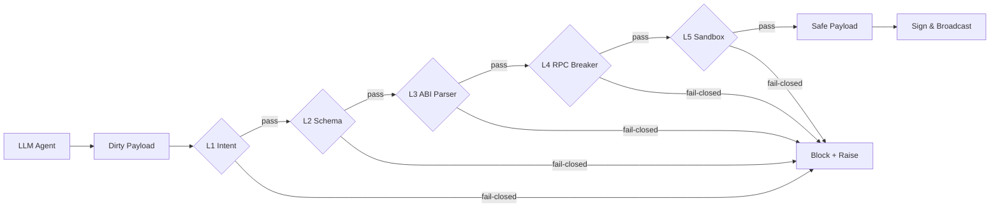
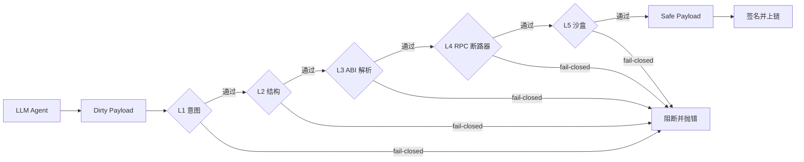

<div align="center">
  
  
  
  
</div>

<p align="center">
  <b>English</b> | <a href="#-简体中文-chinese-version">🇨🇳 简体中文</a> | <a href="#-quickstart">⚡ Quickstart</a> | <a href="#-why-lirix">🎯 Why Lirix?</a> | <a href="#-installation">📦 Installation</a> | <a href="#-project-layout">🗺️ Project Layout</a> | <a href="#-security-model">🛡️ Security Model</a> | <a href="#-support--faq">💬 Support / FAQ</a>
</p>

# Lirix: The Definitive Security Gateway for Web3 AI Agents

[](https://pypi.org/project/lirix/)
[](https://github.com/lokii-D/lirix/actions)

Bridging LLMs to the EVM with deterministic Zero-Gas simulations. Stop AI hallucinations and prompt injections *before* they reach your private keys.

## ⚡ Installation

```bash
pip install lirix
```

## ⚡ From Chaos to Determinism in 3 Lines of Code

```python
from lirix import Lirix

guardian = Lirix(rpc_urls=["https://eth-mainnet..."])

# 100% Zero-Key. Lirix validates, simulates, and returns a safe payload.
# You keep full control of signing and broadcast responsibilities.
safe_payload = guardian.validate_and_simulate(raw_llm_output, intent="swap")
```

## ⚡ Quickstart

```python
from typing import Any

from lirix import Lirix, LirixSecurityException

# Type hints are first-class: your IDE can infer the security boundary.
guardian: Lirix = Lirix(rpc_urls=["https://eth-mainnet..."])

raw_llm_output: str = 'swap 1 ETH for USDC on Uniswap V3'

try:
    # Lirix validates intent, parses calldata, and simulates execution.
    # The returned safe_payload is intentionally separated from signing authority.
    safe_payload = guardian.validate_and_simulate(raw_llm_output, intent="swap")
    sign_and_broadcast(safe_payload)  # Your app signs; Lirix never touches private keys.
except LirixSecurityException as exc:
    # Fail-closed by design: the agent gets a precise remediation hint.
    print(exc.resolution_for_agent)
```

## 🎯 Why Lirix?

Lirix is not just another policy wrapper. It is a deterministic security boundary for untrusted AI output.

- **Deterministic Simulation vs Probabilistic AI Output** — Lirix turns uncertain model text into reproducible execution checks.
- **Physical Isolation vs Soft Policy Guards** — Lirix enforces a hard boundary between intent and chain action, instead of hoping policies are followed.
- **Edge Privacy vs Cloud-based Telemetry** — Lirix keeps validation local, with no analytics stream leaking your operational surface area.

## 🛡️ The 5-Layer Defense Architecture



Lirix acts as an uncompromising physical firewall between AI intent and on-chain execution:

1. **L1 Intent Auditing**: Intercepts prompt injections by matching LLM output against a strict intent whitelist.
2. **L2 Schema Boundaries**: Pydantic v2 strict typing eliminates mathematical hallucinations and non-checksummed black holes.
3. **L3 DeFi Deep Parsing**: Penetrates nested Router calldata (e.g., Uniswap/Multicall) to kill supply-chain poisoning.
4. **L4 Stateful RPC Arbitration**: Multi-node state diffing and Circuit Breakers ruthlessly block stale MEV-vulnerable data.
5. **L5 Zero-Gas Sandbox**: State-overridden `eth_call` simulations predict EVM reverts without spending a dime.

## 🔌 Extensible Hook System

Built for enterprise-grade extensibility without contaminating the open-source core. `HookManager` gives teams a non-invasive insertion point for custom RBAC, cloud sandboxes, policy engines, and observability pipelines.

Use hooks when you need to:

- Enforce organization-specific authorization policies
- Route sensitive flows into isolated cloud sandboxes
- Export execution traces to OTel or internal observability stacks
- Add preflight and postflight controls without forking the core security model

The design principle is simple: the kernel stays deterministic, while the perimeter remains customizable.

## 🗺️ Project Layout

A compressed view of the repo:

```text
lirix/
├── lirix/        # core defense layers
├── tests/        # verification and adversarial coverage
├── docs/         # audit and architecture references
└── SECURITY.md   # disclosure policy and zero-trust rules
```

For the full structure and safety notes, see **[docs/STRUCTURE.md](docs/STRUCTURE.md)**.

The boundary is intentional: **Layers** stay in the core package, while **Audit** lives in docs and policies.

## 🛡️ Security Model

The Lirix Triple-Zero Standard is simple: **Zero-Key, Zero-Telemetry, Zero-Trust**.

In one sentence: Lirix never handles private keys, never emits telemetry, and never assumes untrusted AI output is safe.

🔒 Read the full policy in **[SECURITY.md](SECURITY.md)**.

## ☠️ Before Lirix (Vulnerable)

```python
# AI agent blindly trusts the model output.
# Funds get drained. Rekt.
multicall = ai_agent.generate("swap and stake everything")
sign_and_broadcast(multicall)  # malicious payload slips through
```

## 🛡️ After Lirix (Bulletproof)

```python
from lirix import Lirix, LirixSecurityException

guardian = Lirix(rpc_urls=["https://eth-mainnet..."])
raw = ai_agent.generate("swap and stake everything")

try:
    safe_payload = guardian.validate_and_simulate(raw, intent="swap")
    sign_and_broadcast(safe_payload)
except LirixSecurityException as exc:
    agent_message = exc.resolution_for_agent
    ai_agent.rewrite_intent(agent_message)
```

## 🔌 Native Integrations (LangChain / AutoGen)

```python
from langchain.tools import tool
from lirix import Lirix

guardian = Lirix(rpc_urls=["https://eth-mainnet..."])

@tool("lirix_validate_and_simulate")
def lirix_validate_and_simulate(raw_llm_output: str, intent: str) -> str:
    """Validate AI output through Lirix before any on-chain action."""
    payload = guardian.validate_and_simulate(raw_llm_output, intent=intent)
    return payload.model_dump_json()
```

Lirix is the official gateway for Web3-capable agents: wrap it once, and every downstream tool call inherits the same security boundary.

## 📜 Audit Log Preview

```json
{
  "timestamp": "2026-04-19T12:34:56.789Z",
  "service": "lirix",
  "severity": "WARN",
  "error_code": "LIRIX-L1-INTENT_DENIED",
  "actor": {
    "address": "0x8f3A12cE9dA4bF0D7e1E2C5dF7aA11b2C3D4e5F6A",
    "role": "untrusted_agent"
  },
  "context": "[REDACTED]",
  "payload_hash": "sha256:9f3c...e11d",
  "decision": "blocked",
  "reason": "Prompt injection pattern detected in nested multicall route",
  "resolution_for_agent": "Rewrite intent to a single authorized swap action with explicit token pair and slippage bounds"
}
```

## What Lirix Actually Does

Lirix is a security boundary, not a wallet. It validates untrusted LLM output, parses DeFi payloads, simulates execution, and hands your application a safe payload to sign and broadcast.

### Typical Flow

1. The agent proposes an action.
2. Lirix audits the intent and schema.
3. Lirix parses nested calldata and validates the execution path.
4. Lirix runs a zero-gas simulation against RPC state.
5. Your application signs the returned payload and broadcasts it.

## 💬 Support / FAQ

- General questions and feature ideas: open a thread in **[GitHub Discussions](https://github.com/lokii-D/lirix/discussions)** or file a standard issue in **[GitHub Issues](https://github.com/lokii-D/lirix/issues)**.
- Security vulnerabilities: **do not open an Issue**. Follow the private disclosure flow in **[SECURITY.md](SECURITY.md)**.

### FAQ

**Q: Why doesn’t Lirix need my private key?**

A: Because Lirix is a gatekeeper, not a signer. It validates intent and simulates execution, then returns a safe payload to your application. Your application retains the private key and signing authority; that separation is the whole security model.

## Development Requirements

- Python 3.8–3.14
- `black`
- `ruff`
- `mypy`
- `pytest`
- **Foundry / Anvil** for L5 integration tests

### Local Test Environment

To run the full local suite, install the Python tooling and Foundry first. L5 integration tests depend on Anvil because Lirix’s zero-gas sandbox needs a local EVM simulation backend.

```bash
pip install -e ".[dev]"

# Install Foundry
curl -L https://foundry.paradigm.xyz | bash
foundryup

# Start Anvil in a separate terminal if your test workflow expects a live node
anvil
```

Recommended verification sequence:

```bash
black .
ruff check .
mypy .
pytest
```

If your environment exercises the L5 path, ensure Anvil is running and reachable before executing the integration tests.

## License

MIT — see `LICENSE`.

---

<h1 id="-简体中文-chinese-version">🇨🇳 Lirix：Web3 AI Agent 的终极安全前置网关</h1>

用确定性的零 Gas 模拟试爆，桥接大语言模型（LLM）与 EVM。在 AI 幻觉和提示词注入触达您的私钥**之前**，将其彻底粉碎。

## ⚡ 三行代码，将混沌转化为确定性

```python
from lirix import Lirix

guardian = Lirix(rpc_urls=["https://eth-mainnet..."])

# 100% 零密钥。Lirix 仅负责校验、模拟并返回安全 Payload。
# 你的系统负责签名，职责边界清晰且不可越权。
safe_payload = guardian.validate_and_simulate(raw_llm_output, intent="swap")
```

## ⚡ 快速开始

```python
from typing import Any

from lirix import Lirix, LirixSecurityException

# 类型提示是第一等公民：IDE 可以直接理解安全边界。
guardian: Lirix = Lirix(rpc_urls=["https://eth-mainnet..."])

raw_llm_output: str = '在 Uniswap V3 上将 1 ETH 兑换为 USDC'

try:
    # Lirix 会校验意图、解析 calldata，并执行模拟试爆。
    # safe_payload 与签名权严格解耦，返回值只代表“可安全签名”。
    safe_payload = guardian.validate_and_simulate(raw_llm_output, intent="swap")
    sign_and_broadcast(safe_payload)  # 仍由你的应用完成签名与广播。
except LirixSecurityException as exc:
    # Fail-Closed：把精确的修正建议返回给 Agent，而不是放行危险执行。
    print(exc.resolution_for_agent)
```

## 🎯 为什么选择 Lirix？

Lirix 不是另一个策略包装器，而是面向不可信 AI 输出的确定性安全边界。

- **确定性模拟 vs 概率性 AI 输出** — Lirix 将不稳定的模型文本转化为可复现的执行校验。
- **物理隔离 vs 软性策略防护** — Lirix 在意图与链上动作之间建立硬边界，而不是寄望于策略“会被遵守”。
- **边缘隐私 vs 云端遥测数据流出** — Lirix 在本地完成校验，不把你的运行面扩散到遥测流里。

## 🛡️ 五层防毒面罩架构



Lirix 在 AI 意图与链上执行之间，构建了毫不妥协的物理级防火墙：

1. **L1 意图对账**：通过严格的白名单比对，拦截提示词越狱注入。
2. **L2 静态边界**：Pydantic v2 强类型校验，消除数学计算幻觉与非法黑洞地址。
3. **L3 深度穿透**：穿透嵌套路由的 Calldata，斩杀供应链投毒。
4. **L4 状态机仲裁**：多节点对账与断路器机制，冷酷阻断易被 MEV 夹击的陈旧数据。
5. **L5 零 Gas 试爆**：利用状态覆写的 `eth_call` 本地模拟，零成本精准预测 EVM 回滚。

## 🔌 插件化 Hook 系统

为企业级扩展而生，又不会污染开源核心。`HookManager` 提供了一个无侵入式挂载点，便于接入自定义 RBAC、云端沙盒、策略引擎与 OTel 观测链路。

当你需要以下能力时，Hook 系统就会成为边界层武器：

- 强制执行组织级授权策略
- 将敏感流程路由到隔离云沙盒
- 将执行轨迹导出到 OTel 或内部可观测平台
- 在不 Fork 核心安全模型的前提下添加前置与后置控制

设计原则只有一句话：内核保持确定性，外围保持可扩展性。

## 📦 安装

### 生产环境

```bash
pip install lirix
```

### 开发审计环境

```bash
# 安装 Foundry（L5 沙盒集成测试所必需）
curl -L https://foundry.paradigm.xyz | bash
foundryup

# 安装 Lirix 开发依赖
pip install -e ".[dev]"

# 运行完整本地套件
anvil
tox
```

L5 试爆层需要本地 Foundry / Anvil 支持，才能驱动确定性的 EVM 沙盒后端。

## 🗺️ 项目布局

压缩视图如下：

```text
lirix/
├── lirix/        # 核心防线 Layers
├── tests/        # 验证与对抗测试
├── docs/         # 审计与架构资料
└── SECURITY.md   # 安全披露与零信任规则
```

完整结构与安全说明请查看 **[docs/STRUCTURE.md](docs/STRUCTURE.md)**。

边界是刻意设计的：**核心防御层（Layers）** 留在代码核心，**审计层（Audit）** 归入文档与政策。

## 🛡️ 安全模型

Lirix Triple-Zero Standard 很简单：**零密钥、零遥测、零信任**。

一句话概括：Lirix 永不处理私钥，永不发送遥测，也绝不默认不可信 AI 输出是安全的。

🔒 完整策略见 **[SECURITY.md](SECURITY.md)**。

## ☠️ Lirix 之前（存在风险）

```python
# AI Agent 盲目信任模型输出。
# 资金被盗（Rekt）。
multicall = ai_agent.generate("swap and stake everything")
sign_and_broadcast(multicall)  # 恶意 payload 直接穿透
```

## 🛡️ Lirix 之后（刀枪不入）

```python
from lirix import Lirix, LirixSecurityException

guardian = Lirix(rpc_urls=["https://eth-mainnet..."])
raw = ai_agent.generate("swap and stake everything")

try:
    safe_payload = guardian.validate_and_simulate(raw, intent="swap")
    sign_and_broadcast(safe_payload)
except LirixSecurityException as exc:
    agent_message = exc.resolution_for_agent
    ai_agent.rewrite_intent(agent_message)
```

## 🔌 原生生态接入（LangChain / AutoGen）

```python
from langchain.tools import tool
from lirix import Lirix

guardian = Lirix(rpc_urls=["https://eth-mainnet..."])

@tool("lirix_validate_and_simulate")
def lirix_validate_and_simulate(raw_llm_output: str, intent: str) -> str:
    """在任何链上动作之前，先由 Lirix 完成校验。"""
    payload = guardian.validate_and_simulate(raw_llm_output, intent=intent)
    return payload.model_dump_json()
```

Lirix 就是 Web3 AI Agent 走向生产环境的官方安全网关：一次封装，所有下游工具调用继承同一条安全边界。

## 📜 审计日志预览

```json
{
  "timestamp": "2026-04-19T12:34:56.789Z",
  "service": "lirix",
  "severity": "WARN",
  "error_code": "LIRIX-L1-INTENT_DENIED",
  "actor": {
    "address": "0x8f3A12cE9dA4bF0D7e1E2C5dF7aA11b2C3D4e5F6A",
    "role": "untrusted_agent"
  },
  "context": "[REDACTED]",
  "payload_hash": "sha256:9f3c...e11d",
  "decision": "blocked",
  "reason": "Prompt injection pattern detected in nested multicall route",
  "resolution_for_agent": "Rewrite intent to a single authorized swap action with explicit token pair and slippage bounds"
}
```

## Lirix 的真实职责

Lirix 是安全边界，不是钱包。它校验不可信的 LLM 输出、解析 DeFi 负载、模拟执行，并将可安全签名与广播的 payload 交还给你的应用。

### 典型流程

1. Agent 提出动作意图。
2. Lirix 审计意图与数据结构。
3. Lirix 解析嵌套 calldata 并验证执行路径。
4. Lirix 基于 RPC 状态执行零 Gas 模拟。
5. 你的应用签名返回的 payload 并完成广播。

## 💬 支持 / 常见问题

- 常规问题与功能建议：请在 **[GitHub Discussions](https://github.com/lokii-D/lirix/discussions)** 发起讨论，或到 **[GitHub Issues](https://github.com/lokii-D/lirix/issues)** 提交标准问题。
- 安全漏洞：**严禁提交 Issue**。请直接遵循 **[SECURITY.md](SECURITY.md)** 中的私密披露通道。

### FAQ

**问：为什么 Lirix 不需要我的私钥？**

答：因为 Lirix 是门禁，不是签名器。它只负责校验意图与模拟执行，然后把一个可安全签名的 payload 交回给你的应用。私钥和签名权始终保留在你的系统里——这就是整个安全模型的核心。

## 开发环境要求

- Python 3.8–3.14
- `black`
- `ruff`
- `mypy`
- `pytest`
- **Foundry / Anvil**：用于通过 L5 集成测试

### 本地测试环境

要运行完整的本地测试套件，请先安装 Python 工具链和 Foundry。L5 集成测试依赖 Anvil，因为 Lirix 的零 Gas 沙盒需要本地 EVM 模拟后端。

```bash
pip install -e ".[dev]"

# Install Foundry
curl -L https://foundry.paradigm.xyz | bash
foundryup

# Start Anvil in a separate terminal if your test workflow expects a live node
anvil
```

推荐的校验顺序：

```bash
black .
ruff check .
mypy .
pytest
```

如果你的环境会执行 L5 路径，请在运行集成测试前确认 Anvil 已启动并可访问。

## 许可证

MIT —— 见 `LICENSE`。
