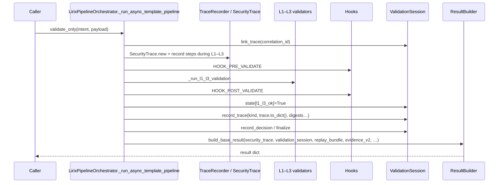
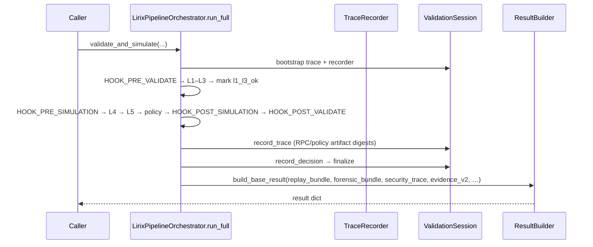

# Pipeline evidence flow (mini)

**EN:** Authoritative technical content in the sections below; repo-wide bilingual conventions: [`documentation_styleguide.md`](documentation_styleguide.md). 
**中文：** 正文为权威技术叙述；全仓双语体例见 [`documentation_styleguide.md`](documentation_styleguide.md)。

## 🔧 Maintainer checklist (orchestrator + facade)

When you **reorder pipeline phases**, rename orchestrator helpers, or change what lands in **`security_trace`** / **`validation_session`** / **`replay_bundle`**:

1. Update **this doc** and **`docs/audit_path_map.md`** rows that cite session / replay semantics (human review — avoid brittle CI string-matching to this prose).
2. Run **`python tools/harness.py contract-manifest`** locally after doc/code edits.
3. Re-run **`python tools/harness.py test-governance`** (or the subset you touched).
4. Regenerate **`docs/lirix_import_topology.md`** with `python tools/gen_lirix_import_graph.py` when import edges shift.

Authoritative code: **`lirix/core/orchestrator.py`** (`LirixPipelineOrchestrator`), **`lirix/_facade.py`** (`Lirix` thin client), **`lirix/core/client_components.py`** (`request_normalization`, `ClientPipelineProtocol`), **`lirix/core/layer_ports.py`** (dependency-inversion protocols), **`lirix/_layer_factories.py`** (L4/L5 assembly wired by the facade).

---

## 📊 Phase overview

| Phase | `validate_only` / `async_validate_only` | `validate_and_simulate` / `async_validate_and_simulate` |
| --- | --- | --- |
| Session + trace bootstrap | `LirixPipelineOrchestrator._run_async_template_pipeline` → `ensure_session`, `sess.link_trace`, `request_normalization` builds `SecurityTrace` + `TraceRecorder` | `Lirix._run_full_pipeline` → `LirixPipelineOrchestrator.run_full` (same bootstrap pattern via orchestrator) |
| Hooks before L1–L3 | `HOOK_PRE_VALIDATE` | `HOOK_PRE_VALIDATE` |
| L1–L3 | `Lirix._run_l1_l3_validation` records steps | Same, then **`_mark_session_l1_l3_ok`** before simulation hooks |
| Isolated post-validate hook | `HOOK_POST_VALIDATE` **after** L1–L3, then `_mark_session_l1_l3_ok` | Full pipeline uses a **trailing** `HOOK_POST_VALIDATE` after L5 |
| Simulation | *(not run)* | `HOOK_PRE_SIMULATION` → L4 `rpc_reconcile` → L5 `sandbox_simulation` → `HOOK_POST_SIMULATION` → trailing `HOOK_POST_VALIDATE` |
| Success persistence | `_success_postlude_and_build_result` → `sess.record_trace` / `record_decision` / `finalize` → `_build_result` | `_record_full_pipeline_success` + `finalize` → `_build_result` |

> **`l1_l3_ok`:** set **after** isolated `HOOK_POST_VALIDATE` on **`validate_only`**, but **before** `HOOK_PRE_SIMULATION` on the **full** pipeline. See [`docs/audit_path_map.md`](audit_path_map.md#session-gate-semantics-l1_l3_ok) § Session gate semantics.

---

## 🧭 Mermaid — `validate_only` success path

## 🧭 Mermaid — full pipeline success path

## ⚠️ Failure paths

On `LirixBaseException`, `LirixPipelineOrchestrator._run_async_template_pipeline` catches, calls **`_record_failure`** (rejected `sess.record_trace`, enriched `agent_feedback`, `failure_protocol`), and returns the fail-closed envelope **without** claiming pipeline success.

---

## 中文（要点对照）

- **编排真相源**：同步入口在 **`lirix/_facade.py`**，异步状态机在 **`lirix/core/orchestrator.py`**；不要再引用已删除的 mixin 文件名。
- **阶段表**：`validate_only` 走 **`_run_async_template_pipeline` + `run_validate`**；全量路径走 **`run_full`**（经 `Lirix._run_full_pipeline` 委托）。
- **失败路径**：统一由 **`_record_failure`** 落盘拒绝态证据；更新语义时同步 **`docs/audit_path_map.md`** 与会话 gating 说明。
