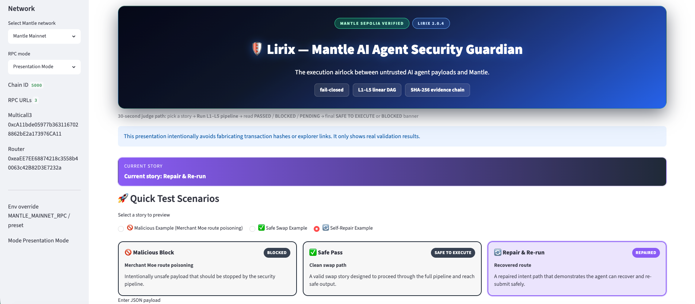
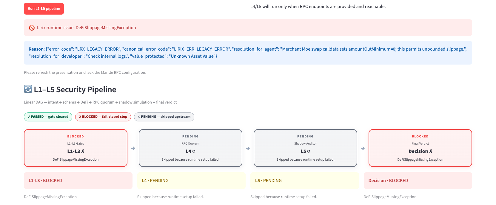
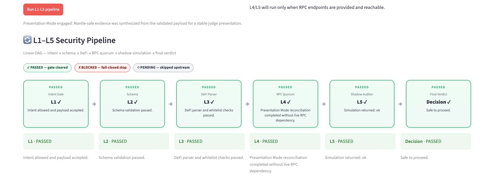
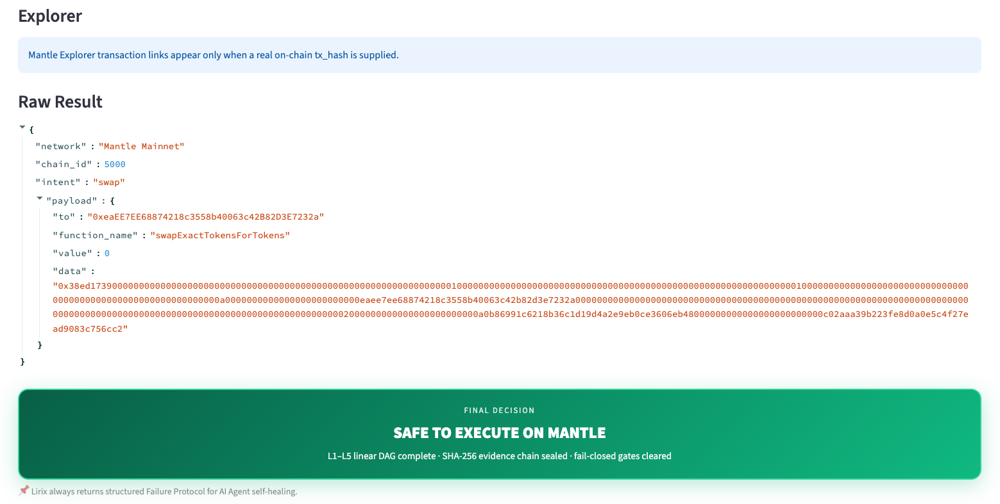

# Lirix 2.0.4 — Mantle AI Agent Security Guardian

<div align="center">

**Mantle DoraHacks 2026** · AI DevTools / Agentic Economy

[](https://huggingface.co/spaces/lokiii07/lirix-mantle-harness)
[](https://sepolia.mantlescan.xyz/tx/0xa23bb06ad14518ea7418082caef761cf864548a6705e8a2682b08c6cd69b055a)

</div>

## TL;DR

**Lirix is the fail-closed execution airlock between AI agents and Mantle.**
An agent proposes a DeFi intent → Lirix runs it through **L1–L5** (intent, schema, calldata, RPC quorum, simulation) → you get **SAFE TO EXECUTE ON MANTLE** or **BLOCKED** — with a SHA-256 evidence chain either way.

**Why Mantle needs this now:** Agentic DeFi on Mantle is accelerating. One poisoned swap route or RPC drift can drain funds irreversibly. Lirix is the only submission here that **blocks before broadcast**, **explains why**, and **anchors proof on Mantle Sepolia**.

---

## Why this is the project worth your first click on Mantle

| Without Lirix | With Lirix 2.0.4 |
| --- | --- |
| AI agent emits calldata → wallet signs → loss on-chain | Every intent passes a **L1–L5 linear DAG** first |
| “Looks valid” Merchant Moe / multicall routes slip through | **L3** parses Mantle-native DeFi shapes; poisoned routes **BLOCKED** |
| RPC nodes disagree; agent guesses | **L4** RPC quorum fails closed — no silent drift |
| Opaque revert; agent retries blindly | **L5** Shadow Auditor + **Failure Protocol** → agent self-heals |
| No audit trail | **SHA-256 evidence chain** + on-chain **LirixShield** anchor |

**The punchline:** Lirix does not replace your signer — it makes sure nothing unworthy ever reaches it.

---

## Judge path — 30 sec · 2 min · 3 min

| Time | Do this | You will see |
| --- | --- | --- |
| **30 sec** | Open the [HF Spaces demo](https://huggingface.co/spaces/lokiii07/lirix-mantle-harness) → pick **Malicious** → **Run L1–L5** | Red **BLOCKED** banner — fail-closed in action |
| **2 min** | Open [on-chain proof tx](https://sepolia.mantlescan.xyz/tx/0xa23bb06ad14518ea7418082caef761cf864548a6705e8a2682b08c6cd69b055a) + [LirixShield contract](https://sepolia.mantlescan.xyz/address/0x844cd69eADcc097F759FBf76C2d9735A55A9635c) | Verified Mantle Sepolia deployment |
| **3 min** | Clone + `./scripts/full_dry_run.sh` (below) | Tests, lint, and submission bundle reproduce locally |

---

## Try it now

**Fastest (no install):** https://huggingface.co/spaces/lokiii07/lirix-mantle-harness

**Local (recommended for reproducibility judges):**

```bash
git clone -b mantle-turing-2026-harness https://github.com/lokii-D/lirix.git
cd lirix

python3 -m venv .venv && source .venv/bin/activate   # Windows: .venv\Scripts\activate
python -m pip install -U pip wheel
python -m pip install -e .                           # Lirix core
python -m pip install -r requirements_submission.txt # streamlit, pytest, ruff, black, web3

cp .env.example .env   # optional Mantle RPC overrides
streamlit run app.py   # or: docker compose up --build → http://localhost:7860
```

**Full harness validation:**

```bash
./scripts/full_dry_run.sh
```

> **Dependency note:** `requirements_submission.txt` is the judge-facing pin list. For contributor tooling (mypy, tox, pre-commit), use `pip install -e ".[dev]"` instead.

---

## Public proof (external — click to verify)

| Artifact | Link |
| --- | --- |
| **Live demo** | https://huggingface.co/spaces/lokiii07/lirix-mantle-harness |
| **GitHub / harness branch** | https://github.com/lokii-D/lirix/tree/mantle-turing-2026-harness |
| **LirixShield contract** | https://sepolia.mantlescan.xyz/address/0x844cd69eADcc097F759FBf76C2d9735A55A9635c |
| **On-chain proof tx** | https://sepolia.mantlescan.xyz/tx/0xa23bb06ad14518ea7418082caef761cf864548a6705e8a2682b08c6cd69b055a |
| **Demo video (2–3 min)** | https://youtu.be/16Oa0ur-NFk |
| **Mantle Sepolia RPC** | `https://rpc.sepolia.mantle.xyz` |

Evidence SSOT (three-layer tracker): [`mantle_TT/external_evidence.md`](mantle_TT/external_evidence.md)

---

## What you are looking at (visual proof)

Screenshots captured from the judge UI — index in [`docs/submission_assets/README.md`](docs/submission_assets/README.md).



| Story | Proof |
| --- | --- |
| Malicious route poisoning |  |
| Safe swap passes full DAG |  |
| Final decision drama |  |

---

## Technical depth (for reviewers who want the stack)

- **L1–L3** — intent gate, schema, Mantle DeFi calldata (Merchant Moe, Agni, multicall, proxy)
- **L4** — multi-RPC quorum + spread fail-closed
- **L5** — zero-gas simulation + Shadow Auditor + agent Failure Protocol
- **2.0.4** — frozen Mantle preset, linear orchestrator DAG, LangChain/AutoGen tools → [`docs/2.0.4_orchestrator.md`](docs/2.0.4_orchestrator.md)
